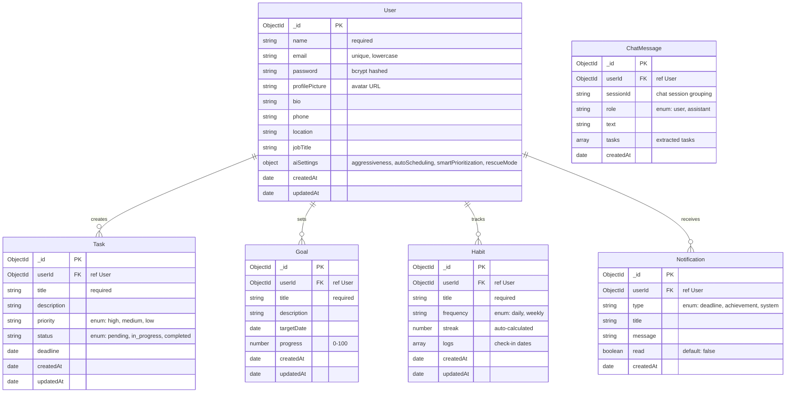

<p align="center">
  <picture>
    <source media="(prefers-color-scheme: dark)" srcset="https://readme-typing-svg.herokuapp.com?font=Fira+Code&weight=700&size=32&duration=3200&pause=600&color=818CF8&center=true&vCenter=true&width=580&height=80&lines=FlowSync+AI;AI-Powered+Productivity+OS;Plan+Smarter+%E2%80%A2+Focus+Better;Never+Miss+a+Deadline+Again">
    
  </picture>
</p>

<p align="center">
  <b>An AI-Powered Productivity Operating System</b><br>
  <i>Proactively analyze, prioritize, and execute — before deadlines become crises.</i>
</p>

<p align="center">
  <a href="https://flowsyncai30.vercel.app"></a>
  <a href="https://github.com/Shubham-997800/FlowSync-Ai"></a>
   <a href="https://github.com/Shubham-997800/FlowSync-Ai/stargazers"></a>
  <a href="https://github.com/Shubham-997800/FlowSync-Ai/releases"></a>
</p>

<p align="center">
  
  
  
  
  
  
  
  
  
  
  
  
  
</p>

<p align="center">
   <a href="https://github.com/Shubham-997800/FlowSync-Ai/releases"></a>
   <a href="https://github.com/Shubham-997800/FlowSync-Ai/releases"></a>
   <a href="https://github.com/Shubham-997800/FlowSync-Ai/releases"></a>
   <a href="https://github.com/Shubham-997800/FlowSync-Ai/releases"></a>
</p>

<br>

---

## 📦 Table of Contents

- [Problem Statement](#-problem-statement)
- [Why FlowSync AI?](#-why-flowsync-ai)
- [Key Features](#-key-features)
- [Screenshots](#-screenshots)
- [Tech Stack](#-tech-stack)
- [System Architecture](#-system-architecture)
- [Project Workflow](#-project-workflow)
- [Folder Structure](#-folder-structure)
- [Database Schema](#-database-schema)
- [API Architecture](#-api-architecture)
- [AI Architecture](#-ai-architecture)
- [Request Lifecycle](#-request-lifecycle)
- [Recent Improvements](#-recent-improvements)
- [Quality Assurance & Testing](#-quality-assurance--testing)
- [Quick Start](#-quick-start)
- [License & Usage](#-license--usage)
- [Author](#-author)
- [Acknowledgements](#-acknowledgements)

---

## 🧠 Problem Statement

### The Productivity Paradox

The average professional uses **3.1 task management tools** simultaneously. Yet **41% of all tasks** remain incomplete. Deadlines slip. Priorities shift. Burnout rises.

Traditional to-do apps fail because they treat productivity as **data entry** — you input tasks, the app stores them, and then sends a passive reminder that you ignore.

```
Current tools:    Input → Store → Remind → Ignore ✓
What we need:     Input → Analyze → Prioritize → Execute
```

### Why Reminders Fail


Reminders treat the symptom (forgetting) without addressing the root cause: **overwhelm and lack of intelligent prioritization**.

### How FlowSync AI Solves This

FlowSync AI replaces passive storage with **active intelligence**. Instead of asking "what's due?", it asks "what matters most right now?" and reshapes your day accordingly.

```
FlowSync AI:  Input → AI Analysis → Priority Engine → Rescue Mode → Execute → Adapt
```

> [!NOTE]
> FlowSync AI is not a to-do list. It is a **decision engine** that uses AI (OpenRouter with 11 models in failover chain) to understand context, predict risk, and optimize every minute of your day.

---

## 🚀 Why FlowSync AI?

### The Vision

We believe productivity tools should work **for** you, not the other way around. The future of task management is **proactive**, not reactive. FlowSync AI was built on three core principles:

| Principle | What It Means |
|-----------|---------------|
| **AI-First, Not AI-Wrapped** | AI isn't a chatbot bolted onto a to-do list. It's the core engine that analyzes, prioritizes, and replans every task in real time. |
| **Proactive > Reactive** | Instead of waiting for you to miss a deadline, FlowSync predicts the risk and suggests corrective action before it's too late. |
| **Context-Aware Execution** | The system understands your workload, your deadlines, your priorities, and your capacity — then builds a schedule that fits. |

### What Makes It Different

| Feature | Traditional To-Do Apps | FlowSync AI |
|---------|----------------------|-------------|
| Task Creation | Manual only | Natural language via AI chat |
| Prioritization | User-defined (static) | AI-driven urgency scores + risk analysis |
| Daily Planning | None or manual | AI-generated optimized time blocks |
| Overload Handling | "You have 12 tasks due" | Rescue Mode — AI replans and compresses |
| Focus Integration | Separate app | Built-in Pomodoro with task sync |
| Habit Tracking | Standalone | Unified with tasks and goals |
| Analytics | Completion % | AI productivity coach with trends |
| Deadline Risk | None | Predictive risk scoring |

---

## ✨ Key Features

### 🤖 AI Capabilities

| Feature | Description |
|---------|-------------|
| **AI Chat Assistant** | Conversational interface — say "Schedule a standup at 10am tomorrow" and the task is created, prioritized, and slotted into your calendar. Chat history is persisted to the database across sessions. |
| **AI Chat History** | Every conversation is saved to MongoDB — browse past chats, delete individual messages, or clear entire history with "New Chat" button. |
| **Multilingual AI Chat** | Auto-detects user language (Hindi, Hinglish, English, Spanish, etc.) and responds in the same language — including Hinglish (Devanagari + English mix). |
| **Smart Daily Planning** | AI analyzes all pending tasks, deadlines, and priorities to generate an optimal day schedule with focused work blocks, breaks, and buffers. |
| **Task Prioritization Engine** | Every task receives a dynamic urgency score (0–100) and risk score (0–100) based on deadline proximity, dependencies, and current workload. |
| **Rescue Mode** | When the day is overloaded, AI identifies what's critical, what can be dropped, and compresses the remaining work into a survivable plan. |
| **AI Task Suggestions** | While typing a task title, AI suggests optimal priority, estimated time, and relevant tags in real-time. |
| **AI Dashboard Coach** | AI-powered productivity recommendations on the dashboard based on actual task data, urgency scores, and risk analysis. |
| **AI Calendar Preview** | Shows AI-priority-ranked tasks per day with risk scores for smarter scheduling. |
| **AI Focus Coach** | Real AI-powered focus suggestions (not local heuristics) — recommends optimal focus time, energy level, break intervals, and personalized reasoning based on task context and workload via the focus-suggest API. |
| **AI Profile Summary** | Personalized productivity score, completion rate, best streak, top strength/weakness, actionable tip, daily goal recommendation, peak productivity time, and motivational message — all AI-generated via the profile-insights API. |
| **AI Notification Organizer** | Smart "AI Sort" button that groups notifications by urgency/priority with AI-generated summaries and contextual reasons via the organize-notifications API. |
| **AI Rescue Mode (Wired)** | Fully integrated Rescue Mode toggle in Settings — activates AI to identify critical tasks, compressed schedule, and drop recommendations when overloaded. |
| **AI Preferences** | Aggressiveness (low/medium/high), auto-scheduling, smart prioritization and rescue-mode toggles — persisted to MongoDB and autosaved on every change. |
| **Productivity Coach** | AI-generated reports that highlight patterns, strengths, weaknesses, and actionable recommendations via the analytics-insights API. |

| **Voice Input** | Speech-to-text via Web Speech API in the AI chat interface for hands-free task creation. |

### 📋 Core Features

| Category | Feature | Details |
|----------|---------|---------|
| 🔐 **Auth** | Login / Signup / 401 / 404 | JWT-based with bcrypt hashing, inline validation, password strength meter (5 levels + colored bars), requirement checklist, framer-motion animations + Helmet SEO |
| 📝 **Tasks** | Full CRUD + Goals | Priority levels, status tracking, deadlines, descriptions, field sanitization, AI suggested priority/estimate/tags, framer-motion staggered list + Helmet SEO |
| 🎯 **Goals** | Milestone Tracking | Target dates, progress percentage, aligned with tasks, animated progress bars |
| 🔄 **Habits** | Streak Tracking | Daily/weekly frequency, auto-calculated streaks, visual weekly grid, framer-motion card animations + Helmet SEO |
| 📅 **Calendar** | Multi-View | Monthly, weekly, and daily views with AI-priority-ranked task suggestions, framer-motion page animation + Helmet SEO |
| ⏱️ **Focus Mode** | Pomodoro Timer | Configurable focus/break durations, task integration, AI break timing suggestions, framer-motion entrance + Helmet SEO |
| 📊 **Analytics** | Deep Insights | Productivity score (animated ring chart), completion rates, weekly/monthly trends, focus session stats, AI-generated report, framer-motion staggered cards + Helmet SEO |
| 🏆 **Achievements** | Gamification | Milestone-based achievements (tasks, goals, focus) with MongoDB persistence |
| 🔔 **Notifications** | Real-Time Drawer | All/Unread filters, grouped by Today / This Week / Earlier, auto deadline reminders, framer-motion list + Helmet SEO |
| 🏠 **Dashboard** | Command Center | Task stats, AI priority cards (live API), productivity score, deadline risk indicators, animated counters with mini sparkline charts + trend indicators, inline task editing, bulk select/complete, collapse completed tasks, quick focus button, AI recommendation refresh + skeleton + error retry + sessionStorage cache (5 min), deadline risk pulse animation + inline mark-done + view all, recent activity grouped by Today/Yesterday/This Week, widget visibility toggle persisted to localStorage, date range filter (All/Week/Month), onboarding empty state with CTAs, ErrorBoundary for resilience, last sync timestamp, AnimatePresence page transitions |
| ⚙️ **Settings** | Full Control | Theme toggle (light/dark/system), AI preferences, profile editing, account deletion, notification channels, framer-motion sidebar stagger + Helmet SEO |
| 👤 **Profile** | Customizable | Avatar upload, bio, phone, location, job title, password change, framer-motion tab animations + Helmet SEO |
| 🎤 **Voice Input** | Speech-to-Text | Browser-native Web Speech API for AI chat and task creation |
| 🌙 **Dark Mode** | Three Themes | Light, dark, and system-follow with smooth CSS transitions |
| 📧 **Push Reminders** | Auto Notifications | Scheduled service that generates deadline alerts via browser push every 30 minutes |

---

## 📸 Screenshots

> 🔗 **Live demo**: [flowsyncai30.vercel.app](https://flowsyncai30.vercel.app) — No login required to explore the landing page.

| Feature Area | Description |
|-------------|-------------|
| 🏠 **Landing Page** | Animated hero, feature cards, how-it-works section, CTA with framer-motion scroll animations |
| 📊 **Dashboard** | AI-powered priority cards, animated stat counters, sparkline charts, deadline risk pulse, recent activity, widget toggles |
| 📝 **Tasks & Goals** | Full CRUD with inline edit, bulk select, sorting (priority/deadline/title), goal progress slider |
| 🤖 **AI Planner** | Chat interface with voice input, session history, task creation via natural language, rescue mode, daily planning |
| 📅 **Calendar** | Multi-view (monthly/weekly/daily) with AI-priority-ranked tasks, load indicators |
| ⏱️ **Focus Mode** | Pomodoro timer with task integration, AI-suggested break timing, configurable intervals |
| 📈 **Analytics** | Productivity score ring chart, completion trends, focus stats, AI-generated insights report |
| 🔔 **Notifications** | Real-time drawer with grouped filters (Today/This Week/Earlier), deadline alerts |
| ⚙️ **Settings** | Theme toggle (light/dark/system), AI consent, notification channels, account management |
| 👤 **Profile** | Avatar upload, bio, stats overview, recent activity timeline |

---

## 🛠️ Tech Stack

### Frontend

| Technology | Version | Purpose | Why We Chose It |
|------------|---------|---------|-----------------|
| **React** | 19 | UI component library | Mature ecosystem, concurrent features, server components |
| **Vite** | 8 | Build tool & dev server | Sub-second HMR, native ESM, optimized production builds |
| **Tailwind CSS** | 4 | Utility-first styling | Rapid prototyping, consistent design system, dark mode |
| **Framer Motion** | Latest | Animation library | Declarative animations, gesture support, layout transitions |
| **React Router** | 7 | Client-side routing | Lazy loading, nested routes, data loading patterns |
| **Axios** | 1 | HTTP client | Interceptors for JWT, request/response transformations |
| **Lucide React** | Latest | Icon library | Consistent, tree-shakeable SVG icon set |
| **React Hot Toast** | 2 | Toast notifications | Lightweight, customizable, promise-based API |
| **React Helmet Async** | Latest | SEO & meta tags | Sets title, OG tags, Twitter cards dynamically |

### Backend

| Technology | Version | Purpose | Why We Chose It |
|------------|---------|---------|-----------------|
| **Node.js** | 24+ | JavaScript runtime | Non-blocking I/O, vast ecosystem, modern JS features |
| **Express** | 4 | Web framework | Minimal, flexible, extensive middleware ecosystem |
| **Mongoose** | 9 | MongoDB ODM | Schema validation, middleware hooks, population queries |
| **MongoDB Atlas** | — | Cloud database | Free tier, auto-scaling, global replication, built-in monitoring |
| **jsonwebtoken** | 9 | JWT auth | Stateless authentication, industry standard |
| **bcryptjs** | 3 | Password hashing | 10 salt rounds, constant-time comparison |
| **Helmet** | 8 | Security headers | XSS, clickjacking, MIME sniffing protection |
| **express-rate-limit** | 8 | Rate limiting | Per-endpoint configurable limits |

### AI & Infrastructure

| Technology | Purpose |
|------------|---------|
| **OpenRouter** | AI chat, planning, prioritization, rescue mode — 11 models in failover chain (GPT-4o-mini, Gemini 2.0 Flash, Claude 3 Haiku, Llama 3.3 70B, Mistral, Cohere, Qwen 2.5 72B, DeepSeek, GPT-4o, Claude 3.5 Haiku) via OpenAI-compatible SDK |
| **Vercel** | Frontend + backend hosting with auto-deploy from GitHub, HTTPS, edge CDN |

---

## 🏗️ System Architecture

```
┌─────────────────────────────────────────────────────────────────────────┐
│                        🌐 DNS (Vercel CDN)                             │
│                      flowsyncai30.vercel.app                           │
├─────────────────────────────────────────────────────────────────────────┤
│                                                                         │
│  ┌───────────────────── FRONTEND (Vercel) ───────────────────────────┐  │
│  │                                                                   │  │
│  │  React 19 + Vite 8 + Tailwind 4 + Framer Motion                  │  │
│  │                                                                   │  │
│  │  ┌─────────┐ ┌───────────┐ ┌──────────┐ ┌──────────┐            │  │
│  │  │ Landing │ │ Dashboard │ │  Tasks   │ │ Calendar │            │  │
│  │  │  Page   │ │  + Stats  │ │ + Goals  │ │ + Views  │            │  │
│  │  ├─────────┤ ├───────────┤ ├──────────┤ ├──────────┤            │  │
│  │  │AI Plan. │ │  Focus    │ │ Analytics│ │  Habits  │            │  │
│  │  │Chat+Plan│ │  Timer    │ │ + Reports│ │ + Streaks│            │  │
│  │  ├─────────┤ ├───────────┤ ├──────────┤ ├──────────┤            │  │
│  │  │Settings │ │  Profile  │ │Notificat.│ │   Auth   │            │  │
│  │  │+ Theme  │ │ + Avatar  │ │ + Filters│ │ + JWT    │            │  │
│  │  └─────────┘ └───────────┘ └──────────┘ └──────────┘            │  │
│  └───────────────────────────────────────────────────────────────────┘  │
│                                  │                                       │
│                    HTTPS + JSON + JWT Bearer Token                       │
│                                  ▼                                       │
│  ┌───────────────────── BACKEND (Vercel Functions) ──────────────────┐  │
│  │                                                                   │  │
│  │  Express 4 + Mongoose 9 + Helmet 8 + Rate Limiter                │  │
│  │                                                                   │  │
│  │  ┌──────────┐  ┌──────────┐  ┌──────────┐  ┌──────────┐         │  │
│  │  │  Auth    │  │  Tasks   │  │  Goals   │  │  Habits  │         │  │
│  │  │  Ctrl    │  │  Ctrl    │  │  Ctrl    │  │  Ctrl    │         │  │
│  │  ├──────────┤  ├──────────┤  ├──────────┤  ├──────────┤         │  │
│  │  │Analytics │  │ Settings │  │Notificat.│  │   AI     │         │  │
│  │  │  Ctrl    │  │  Ctrl    │  │  Ctrl    │  │  Ctrl    │         │  │
│  │  └──────────┘  └──────────┘  └──────────┘  └──────────┘         │  │
│  │                                                                   │  │
│  │  Middleware: JWT Auth → Rate Limiter → Helmet → CORS → Morgan    │  │
│  └───────────────────────────────────────────────────────────────────┘  │
│                                  │                                       │
│                     ┌────────────┴────────────┐                         │
│                     ▼                         ▼                         │
│  ┌────────────────────────┐    ┌────────────────────────┐               │
│  │   🗄️ MongoDB Atlas     │    │   🤖 OpenRouter AI    │               │
│  │                        │    │                        │               │
│  │   Users    Tasks       │    │  OpenAI-compatible     │               │
│  │   Goals    Habits      │    │  chat.completions      │               │
│  │   Notifications        │    │  Structured JSON       │               │
│  └────────────────────────┘    └────────────────────────┘               │
│                                                                         │
└─────────────────────────────────────────────────────────────────────────┘
```

---

## 🔄 Project Workflow

```
                    ┌─────────────┐
                    │  👤 User    │
                    │  Arrives    │
                    └──────┬──────┘
                           ▼
                    ┌─────────────┐
                    │  🔐 Auth    │
                    │  Login/Sign │
                    └──────┬──────┘
                           ▼ (JWT Issued)
              ┌──────────────────────────┐
              │      🏠 Dashboard        │
              │  Task Stats  │  AI Cards │
              │  Calendar   │  Focus     │
              │  Risk Alerts│  Score     │
              └──────┬───────────────────┘
                     │
      ┌──────────────┼──────────────┬──────────────┐
      ▼              ▼              ▼              ▼
┌──────────┐ ┌────────────┐ ┌──────────┐ ┌──────────────┐
│ 📝 Tasks │ │ 🎯 Goals   │ │ 🔄 Habits│ │ 📅 Calendar  │
│ Create   │ │ Set Target │ │ Check In │ │ View Tasks   │
│ Edit     │ │ Track %    │ │ Streak   │ │ Filter by    │
│ Priorit. │ │ Align Tasks│ │ Weekly   │ │ Month/Week   │
└────┬─────┘ └──────┬─────┘ └────┬─────┘ └──────┬───────┘
     │              │            │              │
     └──────────────┴─────┬──────┘              │
                          ▼                     │
              ┌─────────────────────┐            │
              │  🤖 AI Service      │            │
              │                     │            │
              │  Prompt Engineering │            │
              │         ▼           │            │
               │  OpenRouter API     │            │
              │         ▼           │            │
              │  Structured JSON    │            │
              │         ▼           │            │
              │  Response Parser    │            │
              └──────────┬──────────┘            │
                         ▼                       │
              ┌─────────────────────┐            │
              │  AI Outputs         │            │
              │                     │            │
              │  • Priority Scores  │            │
              │  • Daily Schedule   │            │
              │  • Rescue Plan      │            │
              │  • Chat Reply       │            │
              └──────────┬──────────┘            │
                         │                       │
                         ▼                       ▼
              ┌──────────────────────────────────────┐
              │         📊 Analytics Engine          │
              │                                      │
              │  Stats → Weekly → Monthly → Trends   │
              │  Focus Sessions → Completion Rates   │
              └──────────────────┬───────────────────┘
                                 ▼
                    ┌─────────────────────┐
                    │  🔔 Notifications    │
                    │  Real-time updates   │
                    │  Deadline alerts     │
                    └─────────────────────┘
```

---

## 📁 Folder Structure

```
flowsync-ai/
│
├── client/                                # 🎨 React Frontend
│   ├── public/
│   │   ├── favicon.svg                    # Site favicon (also used for push icon/badge)
│   │   ├── icons.svg
│   │   └── sw.js                         # Push notification service worker
│   ├── src/
│   │   ├── main.jsx                       # Entry point
│   │   ├── App.jsx                        # Root component
│   │   ├── index.css                      # Tailwind v4 config (import + dark variant + font)
│   │   │
│   │   ├── routes/
│   │   │   └── AppRoutes.jsx              # Lazy-loaded route definitions
│   │   │
│   │   ├── layouts/
│   │   │   └── MainLayout.jsx             # Sidebar + header + theme wrapper
│   │   │
│   │   ├── context/
│   │   │   ├── AuthContext.jsx            # Auth state (useReducer-based)
│   │   │   └── ThemeContext.jsx           # Dark/light/system theme
│   │   │
│   │   ├── services/
│   │   │   ├── api.js                     # Axios instance + JWT interceptor
│   │   │   ├── authService.js
│   │   │   ├── taskService.js
│   │   │   ├── goalService.js
│   │   │   ├── habitService.js
│   │   │   ├── analyticsService.js
│   │   │   ├── notificationService.js
│   │   │   ├── settingsService.js
│   │   │   ├── aiService.js
│   │   │   ├── pushService.js
│   │   │   └── chatService.js               # Chat history API layer
│   │   │
│   │   ├── components/
│   │   │   ├── Sidebar.jsx                # Navigation sidebar
│   │   │   ├── NotificationPopup.jsx      # Real-time notification drawer
│   │   │   ├── LegalModal.jsx             # Terms & Privacy popup (framer-motion)
│   │   │   ├── AuthLayout.jsx             # Shared auth sidebar layout (Login/Register)
│   │   │   └── ui/                        # Reusable primitives
│   │   │       ├── Card.jsx
│   │   │       ├── Badge.jsx
│   │   │       ├── StatCard.jsx
│   │   │       ├── ProgressBar.jsx
│   │   │       ├── Modal.jsx
│   │   │       └── LoadingSpinner.jsx
│   │   │
│   │   ├── pages/
│   │   │   ├── Landing/                   # Hero, Features, HowItWorks, CTA, Footer (popup modals for legal)
│   │   │   ├── Authentication/            # Login, Register
│   │   │   ├── Dashboard/                 # Stats, AI cards, calendar, focus, risk
│   │   │   ├── TaskManager/               # Task list + Goal manager
│   │   │   ├── Calendar/                  # Monthly/weekly/daily views
│   │   │   ├── FocusMode/                 # Pomodoro timer + settings
│   │   │   ├── Habits/                    # Weekly tracker + streaks
│   │   │   ├── AIPlanner/                 # AI chat, schedule, priority, rescue
│   │   │   ├── Analytics/                 # Charts, trends, AI report
│   │   │   ├── Notifications/             # Notification center
│   │   │   ├── Settings/                  # Theme, AI prefs, danger zone
│   │   │   ├── Profile/                   # Avatar, personal info, password
│   │   │   ├── Legal/                     # Terms of Service, Privacy Policy
│   │   │   └── Error/                     # 404, 401 pages
│   │   │
│   │   └── hooks/                         # Custom React hooks
│   │       ├── useTheme.js
│   │       ├── useAuth.js
│   │       └── useMediaQuery.js
│   │
│   ├── vercel.json                        # SPA routing for Vercel
│   └── package.json
│
├── flowsync-backend/                      # ⚙️ Express API Server
│   ├── server.js                          # Entry point, middleware, route mounting
│   ├── api/index.js                       # Serverless entrypoint (Vercel Functions)
│   │
│   ├── config/
│   │   ├── db.js                          # Mongoose connection with retry logic
│   │   ├── aiConfig.js                    # OpenRouter client (OpenAI SDK)
│   │   └── constants.js                   # Shared app constants
│   │
│   ├── middleware/
│   │   ├── auth.js                        # JWT verification
│   │   ├── rateLimiter.js                 # Rate limiting strategies
│   │   └── requestId.js                   # X-Request-ID correlation (validated/normalized)
│   │
│   ├── models/
│   │   ├── User.js                        # name, email, hashed password, profile, achievements[], aiSettings
│   │   ├── Task.js                        # title, priority, status, deadline, description
│   │   ├── Goal.js                        # title, targetDate, progress
│   │   ├── Habit.js                       # title, frequency, streak, logs[]
│   │   ├── Notification.js                # type, title, message, status, userId (TTL index)
│   │   ├── PushSubscription.js            # endpoint, keys for web push
│   │   ├── ChatMessage.js                 # role, text, tasks[], createdTasks[]
│   │   ├── ChatSession.js                 # sessionId, userId, createdAt, updatedAt
│   │   ├── AiUsage.js                     # daily AI quota tracking
│   │   └── ReminderState.js               # atomic reminder-sweep claims
│   │
│   ├── controllers/
│   │   ├── authController.js              # signup, login
│   │   ├── taskController.js              # CRUD with sanitization + get by id
│   │   ├── goalController.js              # CRUD with sanitization
│   │   ├── habitController.js             # CRUD + check-in + streak calculation (local-timezone aware)
│   │   ├── analyticsController.js         # Stats, weekly, monthly aggregation
│   │   ├── notificationController.js      # Create, list, mark-read, delete
│   │   ├── settingsController.js          # Profile, avatar, password, delete account, achievements, AI settings
│   │   ├── aiController.js               # Chat, plan, prioritize, rescue, suggest-task, analytics-insights, habit-insights, focus-suggest, profile-insights, organize-notifications
│   │   ├── pushController.js             # Web push subscribe/unsubscribe (crash-proof VAPID init)
│   │   └── chatController.js             # Chat history get/save/delete/clear
│   │
│   ├── routes/
│   │   ├── authRoutes.js
│   │   ├── taskRoutes.js
│   │   ├── goalRoutes.js
│   │   ├── habitRoutes.js
│   │   ├── analyticsRoutes.js
│   │   ├── notificationRoutes.js
│   │   ├── settingsRoutes.js             # profile + AI settings (GET/PUT /api/settings/ai)
│   │   ├── aiRoutes.js
│   │   ├── pushRoutes.js
│   │   └── chatRoutes.js                 # Chat history CRUD
│   │
│   ├── services/
│   │   ├── aiService.js                   # Prompt engineering + JSON parsing (11 models, multilingual, tone matching, failover)
│   │   └── reminderService.js             # Auto deadline alerts every 30 minutes (regex-safe)
│   │
│   ├── utils/
│   │   ├── dateKey.js                     # Local-timezone date helpers
│   │   ├── errorHandler.js                # Generic 5xx (no leak), 4xx validation mapping
│   │   └── validateId.js                  # ObjectId validation
│   │
│   ├── test/
│   │   └── run-tests.js                   # 110-test integration harness (real Mongo, same handler Vercel runs)
│   │
│   └── package.json
│
├── .gitignore
├── README.md
└── LICENSE
```

---

## 🗄️ Database Schema

### Entity-Relationship Diagram



### Relationship Details

| Entity | Relation | Cardinality | Description |
|--------|----------|-------------|-------------|
| **User → Task** | One-to-Many | `1 : N` | A user can create unlimited tasks. Each task belongs to exactly one user. |
| **User → Goal** | One-to-Many | `1 : N` | Goals are user-scoped. Tasks can optionally align to goals via title matching. |
| **User → Habit** | One-to-Many | `1 : N` | Each habit is tracked independently per user. Streaks auto-calculate from log dates. |
| **User → Notification** | One-to-Many | `1 : N` | Notifications are generated by the system (deadline alerts, achievement unlocks). |
| **User → ChatMessage** | One-to-Many | `1 : N` | Chat history persisted per user session. |

> [!NOTE]
> The `password` field is excluded from all API responses via Mongoose's `toJSON` transform.

---

## 🌐 API Architecture

```
┌──────────────────────────────────────────────────────────────────────┐
│                         📱 CLIENT (React)                           │
│                                                                      │
│   ┌────────────┐   ┌────────────┐   ┌────────────┐                  │
│   │  Auth Page  │   │ Dashboard  │   │ AI Planner │    ...           │
│   └──────┬─────┘   └──────┬─────┘   └──────┬─────┘                  │
│          │                │                │                         │
│          └────────────────┼────────────────┘                         │
│                           │                                          │
│                    ┌──────▼──────┐                                    │
│                    │  Axios API  │                                    │
│                    │  Service    │                                    │
│                    │  + JWT      │                                    │
│                    └──────┬──────┘                                    │
└───────────────────────────┼──────────────────────────────────────────┘
                            │
                      HTTPS / JSON
                            │
┌───────────────────────────▼──────────────────────────────────────────┐
│                         🖥️ EXPRESS SERVER (Vercel)                    │
│                                                                      │
│   ┌──────────────────────────────────────────────────────┐          │
│   │                 MIDDLEWARE PIPELINE                   │          │
│   │                                                       │          │
│   │   Helmet → CORS → Morgan → Rate Limiter → JSON Parse │          │
│   └──────────────────────┬───────────────────────────────┘          │
│                          │                                           │
│                    ┌─────▼──────┐                                    │
│                    │   Router   │                                    │
│                    └──┬──┬──┬──┘                                    │
│          ┌────────────┘  │  └────────────┐                          │
│          ▼               ▼               ▼                           │
│  ┌────────────┐  ┌────────────┐  ┌────────────┐                    │
│  │  Auth      │  │  Tasks     │  │    AI      │    ...              │
│  │  Routes    │  │  Routes    │  │  Routes    │                     │
│  └──────┬─────┘  └──────┬─────┘  └──────┬─────┘                    │
│         │               │               │                            │
│         ▼               ▼               ▼                            │
│  ┌────────────┐  ┌────────────┐  ┌────────────┐                    │
│  │  Auth      │  │  Task      │  │    AI      │                     │
│  │Controller  │  │Controller  │  │Controller  │                     │
│  └──────┬─────┘  └──────┬─────┘  └──────┬─────┘                    │
│         │               │               │                            │
│         ▼               ▼               ▼                            │
│  ┌────────────┐  ┌────────────┐  ┌────────────┐                    │
│  │  Services  │  │  Mongoose  │  │  AI        │                     │
│  │            │  │  Models    │  │  Service   │                     │
│  └────────────┘  └──────┬─────┘  └──────┬─────┘                    │
│                         │               │                            │
└─────────────────────────┼───────────────┼──────────────────────────┘
                          ▼               ▼
              ┌────────────────────┐  ┌────────────────────┐
               │   🗄️ MongoDB Atlas │  │  🤖 OpenRouter AI │
              │                    │  │                    │
              │  5 Collections    │  │  OpenAI SDK        │
              │  Indexed Queries  │  │  Structured JSON   │
              └────────────────────┘  └────────────────────┘
```

---

## 🤖 AI Architecture

FlowSync AI's intelligence is powered by **OpenRouter** with **11 AI models** in a failover chain (GPT-4o-mini, Gemini 2.0 Flash, Claude 3 Haiku, Llama 3.3 70B, Mistral Small, Cohere Command R+, Qwen 2.5 72B, DeepSeek Chat, GPT-4o, Claude 3.5 Haiku, plus env override), accessed through the **OpenAI-compatible SDK**. The AI layer is designed for reliability, structured output, graceful fallbacks, and full multilingual support with tone matching.

### Architecture Overview

```
┌──────────────────────────────────────────────────────────────────────┐
│                         AI SERVICE LAYER                              │
│                                                                       │
│  ┌──────────────────────────────────────────────────────────┐        │
│  │                    SYSTEM PROMPT                          │        │
│  │                                                            │        │
│  │  "You are FlowSync AI, a productivity engine. Always       │        │
│  │   respond with valid JSON only. No markdown, no            │        │
│  │   explanations."                                           │        │
│  └──────────────────────────┬───────────────────────────────┘        │
│                             │                                         │
│  ┌──────────────────────────▼───────────────────────────────┐        │
│  │                   PROMPT BUILDER                          │        │
│  │                                                            │        │
│  │  Injects: user message + current tasks + context           │        │
│  │                                                            │        │
│  │  Output: fully constructed prompt ready for API call       │        │
│  └──────────────────────────┬───────────────────────────────┘        │
│                             │                                         │
│  ┌──────────────────────────▼───────────────────────────────┐        │
│  │              OpenRouter API (via OpenAI SDK)               │        │
│  │                                                            │        │
│  │  Endpoint: https://openrouter.ai/api/v1                    │        │
│  │  Model:    gpt-4o-mini (first available in 11-model chain)│        │
│  │  Temp:     0.3 (deterministic output)                     │        │
│  │                                                            │        │
│  │  Response: structured JSON string                          │        │
│  └──────────────────────────┬───────────────────────────────┘        │
│                             │                                         │
│  ┌──────────────────────────▼───────────────────────────────┐        │
│  │                  JSON RESPONSE PARSER                     │        │
│  │                                                            │        │
│  │  1. Strip markdown code fences (```json ... ```)           │        │
│  │  2. Attempt JSON.parse()                                   │        │
│  │  3. If fails → find first { and last } -> slice + parse   │        │
│  │  4. If all fails → return default fallback structure       │        │
│  │                                                            │        │
│  │  Output: validated JSON object                             │        │
│  └──────────────────────────┬───────────────────────────────┘        │
│                             │                                         │
│  ┌──────────────────────────▼───────────────────────────────┐        │
│  │               ERROR HANDLING & FALLBACKS                  │        │
│  │                                                            │        │
│  │  • 429 Rate Limit: return AI_SERVICE_UNAVAILABLE           │        │
│  │  • Parse failure: return sensible defaults                 │        │
│  │  • Network error: return cached last response (future)     │        │
│  └──────────────────────────────────────────────────────────┘        │
└──────────────────────────────────────────────────────────────────────┘
```

### AI Capabilities Breakdown

| Capability | Prompt Strategy | Response Format | Fallback |
|------------|----------------|----------------|---------|
| **Chat** | User message + current tasks context | `{ reply, tasks[], suggestions[] }` | Default polite response |
| **Multilingual Chat** | Language detection + tone/style matching — supports Hindi, Hinglish, English, Spanish, French, German, Chinese, Japanese, Arabic, Korean, Portuguese, Russian, Italian, Turkish, Vietnamese, Thai, Indonesian, Bengali, Marathi, Tamil, Telugu, Gujarati, Urdu, Punjabi, and more | Same as Chat | Default English |
| **Daily Plan** | User prompt + task list with deadlines | `{ priority[], schedule[], suggestions[], confidence }` | Empty plan |
| **Prioritize** | Task list with IDs, titles, priorities | `{ rankings[], suggestedOrder[], summary }` | Equal scores |
| **Rescue Mode** | Overloaded task list, 48h window | `{ criticalTasks[], compressedSchedule[], dropRecommendations[] }` | Empty arrays |
| **Suggest Task** | Task title + existing tasks context | `{ suggestedPriority, suggestedEstimatedTime, suggestedTags[], reason }` | Medium priority defaults |
| **Analytics Insights** | Full task/habit/goal data | `{ strengths[], weaknesses[], recommendations[], productivityScore, predictedCompletionRate }` | Static fallback |
| **Focus Suggestion** | Selected task + active tasks context | `{ title, desc, breakSuggestion, focusTime, energyRequired, reason }` | Priority-based local fallback |
| **Profile Insights** | Tasks + habits + goals aggregated | `{ productivityScore, completionRate, strength, weakness, personalizedTip, peakTime, motivationalMessage }` | Calculated local fallback |
| **Organize Notifications** | Full notification list | `{ groups[{name, priority, ids, reason}], prioritizedIds[], summary }` | Flat time-based grouping |
| **Rescue Mode Activation** | Overloaded tasks + 48h window | `{ criticalTasks[], compressedSchedule[], dropRecommendations[], strategy, recoveryHours }` | Empty arrays |
| **Voice Input** | Web Speech API → text → AI chat | Same as Chat | Text input fallback |

---

## ⚡ Request Lifecycle

```
                      ┌────────────────┐
                      │  🌐 Browser    │
                      │  HTTP Request  │
                      └───────┬────────┘
                              │
                      ┌───────▼────────┐
                      │  React Router  │
                      │  (Lazy Load)   │
                      └───────┬────────┘
                              │
                      ┌───────▼────────┐
                      │  Axios Call    │
                      │  + JWT Header  │
                      └───────┬────────┘
                              │
              ┌───────────────┼───────────────┐
              │               │               │
        ┌─────▼─────┐  ┌─────▼─────┐  ┌─────▼─────┐
        │  Auth     │  │  Rate     │  │  Helmet   │
        │  Middle.  │  │  Limiter  │  │  Security │
        └─────┬─────┘  └─────┬─────┘  └─────┬─────┘
              │               │               │
              └───────────────┼───────────────┘
                              │
                      ┌───────▼────────┐
                      │  Express Route │
                      │  (Router)      │
                      └───────┬────────┘
                              │
                      ┌───────▼────────┐
                      │  Controller    │
                      │  (Validation)  │
                      └───────┬────────┘
                              │
               ┌───────────────┬───────────────┐
               │               │               │
         ┌─────▼─────┐  ┌─────▼─────┐
         │  MongoDB  │  │ OpenRouter│
         │  Query    │  │  API Call │
         └─────┬─────┘  └─────┬─────┘
               │               │
               └───────┬───────┘
                              │
                      ┌───────▼────────┐
                      │  JSON Response │
                      │  + Status Code │
                      └───────┬────────┘
                              │
                      ┌───────▼────────┐
                      │  Axios Res.    │
                      │  Interceptor   │
                      └───────┬────────┘
                              │
                      ┌───────▼────────┐
                      │  React State   │
                      │  Update + UI   │
                      └───────┬────────┘
                              │
                      ┌───────▼────────┐
                      │  🎨 Render    │
                      └────────────────┘
```

---

## ⚡ Performance & Build Optimizations

```
┌─────────────────────────────────────────────────────────────────┐
│                    BUNDLE BREAKDOWN (Code Splitting)             │
├─────────────────────────────────────────────────────────────────┤
│  vendor (React 19)     181 kB  │  motion (Framer Motion) 125 kB│
│  utils (Axios, etc.)    73 kB  │  router (React Router)   42 kB│
│  icons (Lucide)         25 kB  │  app code                56 kB│
└─────────────────────────────────────────────────────────────────┘
```

| Optimization | Implementation |
|-------------|---------------|
| **Code Splitting** | `manualChunks` splits vendor (181 kB), router (42 kB), motion (125 kB), icons (26 kB), utils (73 kB), app (57 kB). Dashboard chunk: 41.6 kB (9.9 kB gzip) — all features included |
| **Lazy Loading** | All pages loaded via `React.lazy()` + `Suspense` — only requested code loads (auth pages ~2-3 kB gzip each) |
| **Skeleton Loading** | `LoadingSpinner` with `page` prop renders full skeleton layout (pulse animation) instead of basic spinner |
| **Font Loading** | Google Fonts (Inter) loaded via `<link preload>` + `preconnect` — no render blocking |
| **Scroll Performance** | `will-change-transform` on animated elements, passive scroll listeners, `content-visibility` via framer-motion |
| **Animation Performance** | All animations handled by framer-motion (GPU-accelerated) — zero CSS `@keyframes` |
| **React.memo** | Dashboard sub-components wrapped with `React.memo` — prevent unnecessary re-renders |
| **CSS Size** | Minimal CSS — Tailwind v4 purges unused styles; only ~63 kB (10.5 kB gzip) |
| **Animated Counters** | Dashboard stat cards count up from 0 → value with cubic ease-out animation via requestAnimationFrame |
| **Mini Sparkline Charts** | Each stat card shows a 7-day completion trend as an inline SVG sparkline (no extra libraries) |
| **Trend Indicators** | Today's Tasks card shows ↑/↓ % change comparing first 3 vs last 3 days of weekly data |
| **Inline Task Editing** | Click task title → inline input appears; Enter/Blur saves, Escape cancels — no modal needed |
| **Bulk Actions** | Multi-select checkbox on Today's Tasks → "Complete N" button for batch operations |
| **Collapse Completed** | Toggle to show/hide completed tasks below remaining tasks with AnimatePresence |
| **Widget Customization** | Settings dropdown lets users toggle visibility of 7 dashboard sections, persisted to localStorage |
| **Date Range Filter** | "All Time" / "This Week" / "This Month" toggle filters all dashboard data by task deadline |
| **Error Resilience** | React ErrorBoundary wraps entire dashboard — one widget failure doesn't crash the page |
| **Onboarding Empty State** | First-time users see welcome card with "Create Task" and "Talk to AI" CTAs instead of empty stats |
| **AI Recommendation Caching** | sessionStorage caches AI responses for 5 minutes — no redundant API calls on tab switch |
| **Deadline Risk Pulse** | Overdue items get red glow shadow + animated progress bars for urgency attention |
| **Time-Grouped Activity** | Recent Activity grouped by "Today" / "Yesterday" / "This Week" with click-to-navigate |
| **Last Sync Timestamp** | Header shows "Last updated 30s ago" with auto-updating counter |
| **Auto-Refresh** | Dashboard auto-fetches tasks every 60s + on tab visibility change + manual refresh button — AI-created tasks appear instantly |
| **SEO** | Dynamic `<title>`, meta description, OG tags, Twitter cards via `react-helmet-async` on all pages (landing, auth, legal, error, dashboard) |

---

## 🆕 Recent Improvements

### Version History

| Version | Tag | Highlights |
|---------|-----|------------|
| **v1.0** | `Core` | Initial 14 pages — Landing, Auth (Login/Register with JWT), Dashboard, Tasks & Goals, Calendar (monthly/weekly/daily), Habits (streak tracking), Focus Mode (Pomodoro), Analytics (charts), Notifications, Settings, Profile, AI Planner (chat), 404/401. Full responsive audit across 8 breakpoints (320px–1920px+). Basic AI features (chat, plan, prioritize). MongoDB Atlas + Express backend. |
| **v2.0** | `Production` | Performance audit — re-render fixes, 51 CSS transitions optimized, 12 files deleted (+400 lines of dead code removed), React.memo + useCallback + ErrorBoundary everywhere. Security — CSP headers, rate limiting, account lockout, ObjectId validation, request ID tracing, JWT secret enforcement. Accessibility — skip-to-content, focus trap, prefers-reduced-motion, ARIA toggles. Dashboard overhaul — animated counters, sparkline charts, bulk actions, inline editing, AI caching, widget toggles. UX — undo toast, skeleton loading, polling optimization, framer-motion speed tuning. AI expansion — 11-model failover chain, 25+ languages, tone matching, reduced token cost. |
| **v3.0** | `AI Complete` | AI in every tab — FocusMode real API (replaced local heuristic), Profile AI Productivity Summary, Notifications AI Smart Sort, Settings Rescue Mode wired to backend. Layout standardization — consistent `px-4 sm:px-6 lg:px-8 py-8` on all pages, card padding normalized to `p-6`, AIPlanner full-screen overflow fixed. Zero ESLint errors. All gradients removed — 21 instances across 8 files replaced with solid colors. |
| **v3.1** | `Hardening` | Full-stack security & reliability round. Backend: NoSQL + regex injection closed, cross-user task write and push-subscription hijack blocked, no error leaks on 500, crash-proof VAPID init (fixes live Vercel 500), awaited DB connect with FATAL exit, validated request IDs, cascade account delete, AI quota only on success, notifications TTL index, `GET /tasks/:id` + notification DELETE, AI settings persisted via `GET/PUT /api/settings/ai`, UTC-vs-local date normalization. Frontend: Achievements real checks, AI settings autosave, StrictMode-safe timer, TodayTasks edit (no longer toggles status), real best-streak data, custom FocusMode durations. **110/110 integration tests passing.** |
| **v3.1.1** | `Cleanup` | Dead code removed — unused seed scripts (`seed.js`, `qa-seed.js`), unused client assets (`hero.png`, `react.svg`, `vite.svg`), stock Vite template README replaced. Broken push icon refs (`/favicon.ico`) fixed to `/favicon.svg`. `VAPID_SUBJECT` env wired into push config. ~599 lines of dead code deleted; harness still 110/110. |
| **v3.2** | `Hardened` | Auth: **7-day access tokens + 30-day refresh tokens** with rotation, server-side logout revocation (token versioning), and auto-refresh on the client. Reliability: **CI pipeline** (GitHub Actions — backend tests + frontend lint/build), **always-on pagination** (bounded default 500–1000), **API-side XSS sanitization** (strips `<script>`/`<iframe>`), **structured JSON error logs** with request IDs, and a **`/api/health` endpoint** (DB state + uptime). Performance: **Settings page code-split** (428 kB → 3.4 kB main chunk; `jspdf`/`html2canvas` load only on demand). AI: no-key failures now map to graceful 503 instead of 500. **Harness: 119/119 tests passing.** |

---

## 🧪 Quality Assurance & Testing

FlowSync AI ships with an automated integration harness that runs the **exact same Express handler Vercel executes** (`api/index.js`) against a real MongoDB instance (in-memory 6.0.9). No mocks, no stubs — every route is exercised end-to-end.

**Current status: 119/119 tests passing · frontend lint clean · production build succeeds · CI: GitHub Actions (backend tests + frontend lint/build).**

| Coverage Area | What's Verified |
|---|---|
| 🔐 **Auth & Security** | Signup/login, duplicate & non-string → 400, no password-hash leak, NoSQL injection blocked, account lockout (423) + auto-reset, expired/tampered/garbage JWT → 401, rate limiting (429), CORS allowlist + non-reflection, Helmet headers, request IDs |
| 📝 **Tasks / Goals / Habits** | Full CRUD, validation 400s, status transitions, `GET /tasks/:id`, cross-user isolation (404), progress clamping, check-in + same-day dedupe, streak calculation |
| 🔔 **Notifications / Push** | Create/list/mark-read/**delete**, cross-user isolation, subscribe/unsubscribe, missing keys → 400, subscription ownership |
| 💬 **Chat** | Save/history/sessions/delete/clear, 7-session cap, per-user isolation |
| ⚙️ **Settings** | Profile update, weak-password → 400, password change invalidates old token, account delete cascade (Chat/Push/AiUsage), **AI settings persist + invalid → 400** |
| 🤖 **AI** | Usage tracking, quota check, no-prompt → 400, graceful 5xx without API key |
| ⚡ **DB & Reliability** | Pagination (`?limit&page` + `X-Total-Count`), 413 body limit, atomic reminder claims (no duplicate notifications), TTL cleanup |

### Running the tests

```bash
cd flowsync-backend
npm install
node test/run-tests.js     # boots a real in-memory Mongo + the Vercel handler, runs 110 checks
```

The full audit — findings, fixes, and remaining recommendations — lives in [`QA_REPORT.md`](./QA_REPORT.md).

---

## 🗺️ Future Roadmap

| Focus | Improvements |
|-------|-------------|
| **TypeScript** | Migrate frontend to TypeScript (strict mode) + backend type definitions |
| **Testing** | Expand harness to E2E (Playwright); wire the existing 110 tests into CI (GitHub Actions) |
| **Backend Validation** | Input validation middleware (express-validator/zod), MongoDB indexes |
| **Auth Upgrade** | Refresh tokens, server-side logout, API versioning, social login |
| **Performance** | React Query/SWR for caching, default pagination, AI streaming via SSE |
| **UX Pro** | Keyboard shortcuts, drag-and-drop tasks, file attachments, PWA offline |
| **Platform** | Docker setup, i18n multi-language, Storybook |

---

---

## 🚀 Quick Start

### Prerequisites

- **Node.js 24+** and npm
- **MongoDB** (Atlas cluster or local) with a connection string
- **OpenRouter API key** (for AI features) and generated **VAPID keys** (for push) — optional; the app degrades gracefully without them

### 1. Backend

```bash
cd flowsync-backend
npm install
cp .env.example .env        # then fill in MONGODB_URI, JWT_SECRET, CLIENT_URL, OPENROUTER_API_KEY, VAPID keys
npm run dev                 # API on http://localhost:5000
```

### 2. Frontend

```bash
cd client
npm install
npm run dev                 # app on http://localhost:5173
```

Point the client at the API via the Vite proxy / `.env` (see `client/.env.example` if present).

### Environment variables (backend `.env`)

| Variable | Required | Notes |
|---|---|---|
| `MONGODB_URI` | ✅ | MongoDB Atlas connection string |
| `JWT_SECRET` | ✅ | ≥ 32 random characters; app refuses to boot without it |
| `CLIENT_URL` | ✅ | CORS allowlist for your frontend origin |
| `OPENROUTER_API_KEY` | ⭐ | Enables all AI features |
| `VAPID_PUBLIC_KEY` / `VAPID_PRIVATE_KEY` | ⭐ | Web Push; if invalid, push auto-disables instead of crashing |

> [!TIP]
> Generate VAPID keys with `npx web-push generate-vapid-keys`.

### Deployment

Backend and frontend both deploy to **Vercel** (auto-deploy from the `main` branch). The backend uses the serverless entrypoint `flowsync-backend/api/index.js`; set the same env vars above in your Vercel project settings.

---

## 📄 License & Usage

### Proprietary License — All Rights Reserved

**Copyright © 2024-2026 Shubham Dangi. All rights reserved.**

This software and its source code are the intellectual property of **Shubham Dangi**. It is **not** open-source software. A [`LICENSE`](./LICENSE) file is included in the repository.

| Right | Allowed? | Details |
|-------|----------|---------|
| View Code | ✅ Yes | Public on GitHub for portfolio/reference |
| Use Live App | ✅ Yes | You may use the hosted version at [flowsyncai30.vercel.app](https://flowsyncai30.vercel.app) |
| Copy / Download | ❌ No | Requires written permission from the author |
| Clone / Fork | ❌ No | Requires written permission from the author |
| Modify / Redistribute | ❌ No | Requires written permission from the author |
| Commercial Use | ❌ No | Requires a separate commercial license |

### How to Get Permission

If you want to use, copy, or reference any part of this code, simply contact me:

| Method | Contact |
|--------|---------|
| 📧 Email | [shubhamkumar997800@gmail.com](mailto:shubhamkumar997800@gmail.com) |
| 💼 LinkedIn | [Shubham Dangi](https://linkedin.com/in/shubham997800) |
| 🐙 GitHub | [Shubham-997800](https://github.com/Shubham-997800) |

I'm happy to discuss collaboration, licensing, or any other use — just ask.

> [!IMPORTANT]
> This repository is shared publicly for **portfolio and demonstration purposes only**. Viewing is free. Everything else requires my permission. Unauthorized copying, forking, or distribution will be considered a violation of intellectual property rights.

---

## 👤 Author

<p align="center">
  
</p>

<p align="center">
  <a href="https://github.com/Shubham-997800">
    
  </a>
  <a href="https://linkedin.com/in/shubham997800">
    
  </a>
  <a href="mailto:shubhamkumar997800@gmail.com">
    
  </a>
</p>

---

## 🙏 Acknowledgements

- **[OpenRouter](https://openrouter.ai)** — For the AI API gateway powering our engine (GPT-4o-mini, Gemini 2.0 Flash, Claude 3 Haiku, Llama 3.3 70B, and 7 more models in failover chain)
- **[Vercel](https://vercel.com)** — For frontend and backend hosting with auto-deploys
- **[MongoDB Atlas](https://mongodb.com/atlas)** — For the generous free tier and global database infrastructure
- **[Tailwind CSS](https://tailwindcss.com)** — For the most productive CSS framework ever built
- **[Lucide](https://lucide.dev)** — For the beautiful, consistent icon set

Inspired by the next generation of AI-first productivity tools that are redefining how humans interact with their work.

---

<p align="center">
  <b>FlowSync AI</b> — <i>Never Miss a Deadline Again</i><br>
  <a href="https://flowsyncai30.vercel.app">🌐 Live App</a>
  ·
  <a href="https://github.com/Shubham-997800/FlowSync-Ai/issues">🐛 Report Bug</a>
  ·
  <a href="https://github.com/Shubham-997800/FlowSync-Ai/issues">💡 Request Feature</a>
  ·
  <a href="https://github.com/Shubham-997800/FlowSync-Ai/stargazers">⭐ Star on GitHub</a>
</p>

<p align="center">
  <sub>© 2024-2026 Shubham Dangi. Proprietary software. All rights reserved.</sub>
</p>
