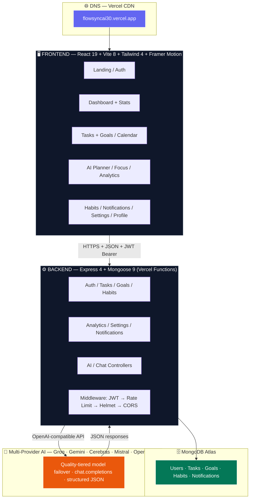
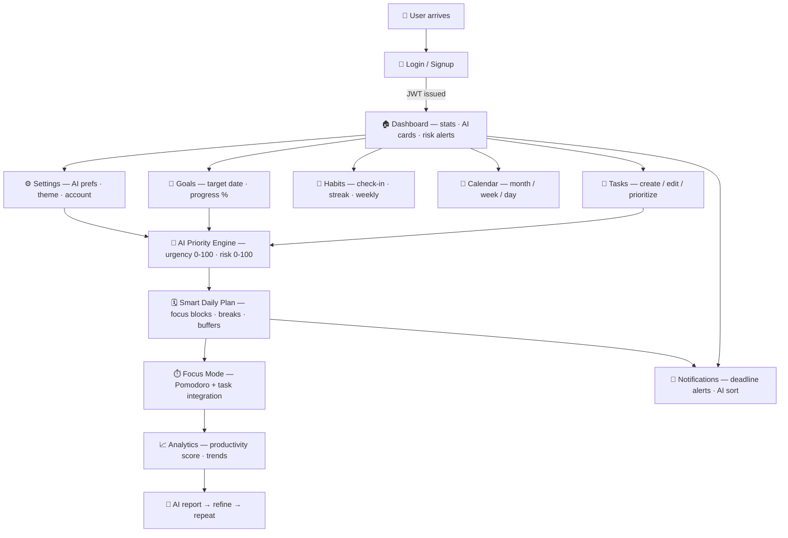
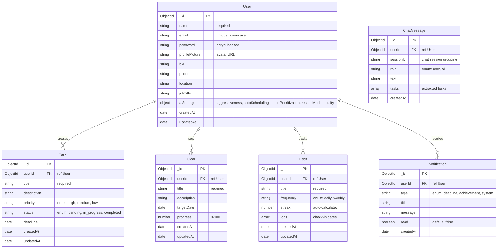
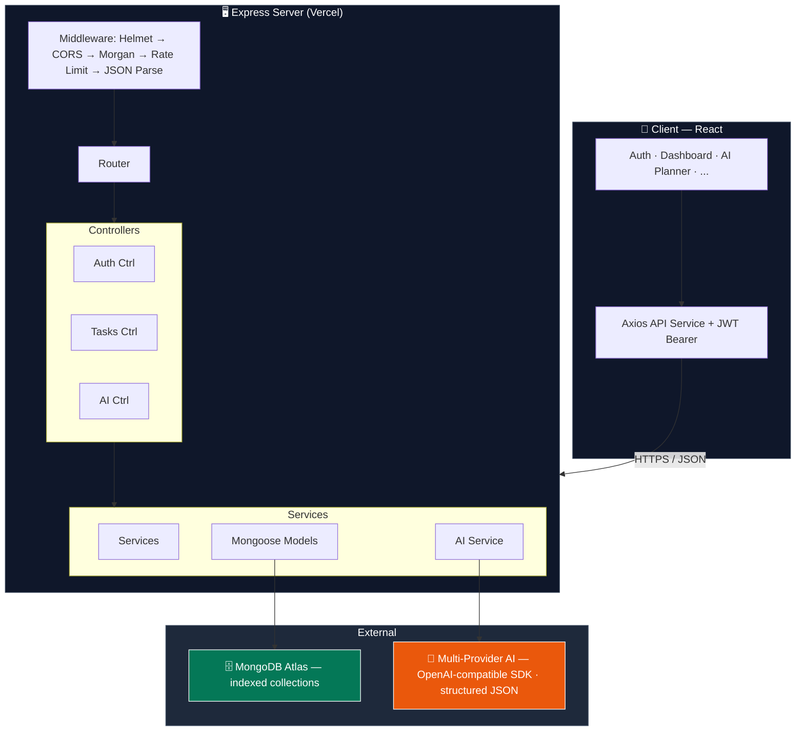
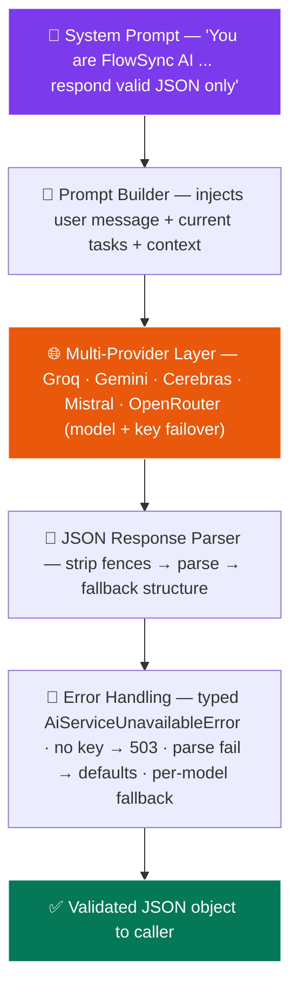
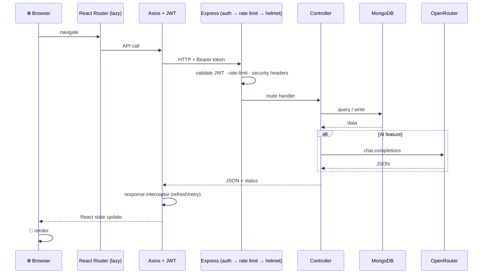
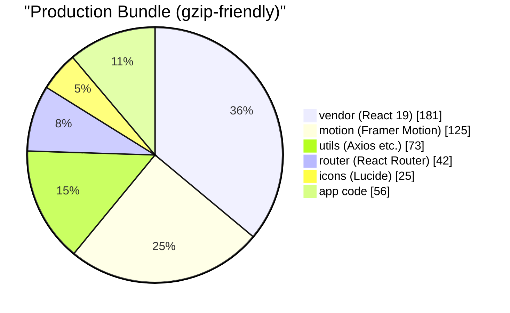

<p align="center">
  <picture>
    <source media="(prefers-color-scheme: dark)" srcset="https://readme-typing-svg.herokuapp.com?font=Fira+Code&weight=700&size=32&duration=3200&pause=600&color=818CF8&center=true&vCenter=true&width=580&height=80&lines=FlowSync+AI;AI-Powered+Productivity+OS;Plan+Smarter+%E2%80%A2+Focus+Better;Never+Miss+a+Deadline+Again">
    
  </picture>
</p>

<p align="center">
  <b>An AI-Powered Productivity Operating System</b><br>
  <i>Proactively analyze, prioritize, and execute — before deadlines become crises.</i>
</p>

<p align="center">
  <a href="https://flowsyncai30.vercel.app"></a>
  <a href="https://github.com/Shubham-997800/FlowSync-Ai"></a>
   <a href="https://github.com/Shubham-997800/FlowSync-Ai/stargazers"></a>
  <a href="https://github.com/Shubham-997800/FlowSync-Ai/releases"></a>
</p>

<p align="center">
  
  
  
  
  
  
  
  
  
  
  
  
  
  
  
  
  
</p>

<p align="center">
   <a href="https://github.com/Shubham-997800/FlowSync-Ai/releases"></a>
</p>

<br>

---

## 📦 Table of Contents

- [Problem Statement](#-problem-statement)
- [Why FlowSync AI?](#-why-flowsync-ai)
- [Key Features](#-key-features)
- [Product Tour](#-product-tour)
- [Tech Stack](#-tech-stack)
- [System Architecture](#-system-architecture)
- [Project Workflow](#-project-workflow)
- [Folder Structure](#-folder-structure)
- [Database Schema](#-database-schema)
- [API Architecture](#-api-architecture)
- [API Reference](#-api-reference)
- [Database Indexes](#-database-indexes)
- [AI Architecture](#-ai-architecture)
- [Request Lifecycle](#-request-lifecycle)
- [Performance & Build Optimizations](#-performance--build-optimizations)
- [Recent Improvements](#-recent-improvements)
- [Quality Assurance & Testing](#-quality-assurance--testing)
- [Future Roadmap](#-future-roadmap)
- [Quick Start](#-quick-start)
- [License & Usage](#-license--usage)
- [Author](#-author)
- [Acknowledgements](#-acknowledgements)

---

## 🧠 Problem Statement

### The Productivity Paradox

The average professional uses **3.1 task management tools** simultaneously. Yet **41% of all tasks** remain incomplete. Deadlines slip. Priorities shift. Burnout rises.

Traditional to-do apps fail because they treat productivity as **data entry** — you input tasks, the app stores them, and then sends a passive reminder that you ignore.

```
Current tools:    Input → Store → Remind → Ignore ✓
What we need:     Input → Analyze → Prioritize → Execute
```

### Why Reminders Fail


Reminders treat the symptom (forgetting) without addressing the root cause: **overwhelm and lack of intelligent prioritization**.

### How FlowSync AI Solves This

FlowSync AI replaces passive storage with **active intelligence**. Instead of asking "what's due?", it asks "what matters most right now?" and reshapes your day accordingly.

```
FlowSync AI:  Input → AI Analysis → Priority Engine → Rescue Mode → Execute → Adapt
```

> [!NOTE]
> FlowSync AI is not a to-do list. It is a **decision engine** that uses AI (OpenRouter with quality-tiered model failover) to understand context, predict risk, and optimize every minute of your day.

---

## 🚀 Why FlowSync AI?

### The Vision

We believe productivity tools should work **for** you, not the other way around. The future of task management is **proactive**, not reactive. FlowSync AI was built on three core principles:

| Principle | What It Means |
|-----------|---------------|
| **AI-First, Not AI-Wrapped** | AI isn't a chatbot bolted onto a to-do list. It's the core engine that analyzes, prioritizes, and replans every task in real time. |
| **Proactive > Reactive** | Instead of waiting for you to miss a deadline, FlowSync predicts the risk and suggests corrective action before it's too late. |
| **Context-Aware Execution** | The system understands your workload, your deadlines, your priorities, and your capacity — then builds a schedule that fits. |

### What Makes It Different

| Feature | Traditional To-Do Apps | FlowSync AI |
|---------|----------------------|-------------|
| Task Creation | Manual only | Natural language via AI chat |
| Prioritization | User-defined (static) | AI-driven urgency scores + risk analysis |
| Daily Planning | None or manual | AI-generated optimized time blocks |
| Overload Handling | "You have 12 tasks due" | Rescue Mode — AI replans and compresses |
| Focus Integration | Separate app | Built-in Pomodoro with task sync |
| Habit Tracking | Standalone | Unified with tasks and goals |
| Analytics | Completion % | AI productivity coach with trends |
| Deadline Risk | None | Predictive risk scoring |

---

## ✨ Key Features

### 🤖 AI Capabilities

| Feature | Description |
|---------|-------------|
| **AI Chat Assistant** | Conversational interface — say "Schedule a standup at 10am tomorrow" and the task is created, prioritized, and slotted into your calendar. Chat history is persisted to the database across sessions. |
| **AI Chat History** | Every conversation is saved to MongoDB — browse past chats, delete individual messages, or clear entire history with "New Chat" button. |
| **AI Chat Context** | The assistant remembers the last 8 messages of the current session and grounds every reply in your real tasks, goals, and habits — no invented tasks. |
| **AI Chat Auto Tone** | No mode chooser needed — the assistant auto-detects the tone of your message (fun / companion / normal) and matches it. Ask "make it fun" or roast-style prompts and the tone shifts naturally; otherwise it stays helpful and task-focused. Model tier is controlled by AI settings, not the chat UI. |
| **AI Usage Meter** | Live "used/limit today" counter in the AI Chat header so you always know your remaining daily AI quota. |
| **Multilingual AI Chat** | Auto-detects user language (Hindi, Hinglish, English, Spanish, etc.) and responds in the same language — including Hinglish (Devanagari + English mix). |
| **Smart Daily Planning** | AI analyzes all pending tasks, deadlines, and priorities to generate an optimal day schedule with focused work blocks, breaks, and buffers. |
| **Task Prioritization Engine** | Every task receives a dynamic urgency score (0–100) and risk score (0–100) based on deadline proximity, dependencies, and current workload. |
| **Rescue Mode** | When the day is overloaded, AI identifies what's critical, what can be dropped, and compresses the remaining work into a survivable plan. |
| **AI Task Suggestions** | While typing a task title, AI suggests optimal priority, estimated time, and relevant tags in real-time. |
| **AI Dashboard Coach** | AI-powered productivity recommendations on the dashboard based on actual task data, urgency scores, and risk analysis. |
| **AI Calendar Preview** | Shows AI-priority-ranked tasks per day with risk scores for smarter scheduling. |
| **AI Focus Coach** | Real AI-powered focus suggestions (not local heuristics) — recommends optimal focus time, energy level, break intervals, and personalized reasoning based on task context and workload via the focus-suggest API. |
| **AI Profile Summary** | Personalized productivity score, completion rate, best streak, top strength/weakness, actionable tip, daily goal recommendation, peak productivity time, and motivational message — all AI-generated via the profile-insights API. |
| **AI Notification Organizer** | Smart "AI Sort" button that groups notifications by urgency/priority with AI-generated summaries and contextual reasons via the organize-notifications API. |
| **AI Rescue Mode (Wired)** | Fully integrated Rescue Mode toggle in Settings — activates AI to identify critical tasks, compressed schedule, and drop recommendations when overloaded. |
| **AI Preferences** | Aggressiveness (low/medium/high), auto-scheduling, smart prioritization and rescue-mode toggles — persisted to MongoDB and autosaved on every change. |
| **Productivity Coach** | AI-generated reports that highlight patterns, strengths, weaknesses, and actionable recommendations via the analytics-insights API. |

| **Voice Input** | Speech-to-text via Web Speech API in the AI chat interface for hands-free task creation. |

### 📋 Core Features

| Category | Feature | Details |
|----------|---------|---------|
| 🔐 **Auth** | Login / Signup / 401 / 404 | JWT-based with bcrypt hashing, inline validation, password strength meter (5 levels + colored bars), requirement checklist, framer-motion animations + Helmet SEO. **No email verification required** — sign up and log in instantly |
| 📝 **Tasks** | Full CRUD + Goals | Priority levels, status tracking, deadlines, descriptions, field sanitization, AI suggested priority/estimate/tags, framer-motion staggered list + Helmet SEO |
| 🎯 **Goals** | Milestone Tracking | Target dates, progress percentage, aligned with tasks, animated progress bars |
| 🔄 **Habits** | Streak Tracking | Daily/weekly frequency, auto-calculated streaks, visual weekly grid, framer-motion card animations + Helmet SEO |
| 📅 **Calendar** | Multi-View | Monthly, weekly, and daily views with AI-priority-ranked task suggestions, framer-motion page animation + Helmet SEO |
| ⏱️ **Focus Mode** | Pomodoro Timer | Configurable focus/break durations, task integration, AI break timing suggestions, framer-motion entrance + Helmet SEO |
| 📊 **Analytics** | Deep Insights | Productivity score (animated ring chart), completion rates, weekly/monthly trends, focus session stats, AI-generated report, **one-click report export in PDF / DOCX / TXT / JSON / XML / CSV**, framer-motion staggered cards + Helmet SEO |
| 🏆 **Achievements** | Gamification | Milestone-based achievements (tasks, goals, focus) with MongoDB persistence |
| 🔔 **Notifications** | Real-Time Drawer | All/Unread filters, grouped by Today / This Week / Earlier, auto deadline reminders, framer-motion list + Helmet SEO |
| 🏠 **Dashboard** | Command Center | Task stats, AI priority cards (live API), productivity score, deadline risk indicators, animated counters with mini sparkline charts + trend indicators, inline task editing, bulk select/complete, collapse completed tasks, quick focus button, AI recommendation refresh + skeleton + error retry + sessionStorage cache (5 min), deadline risk pulse animation + inline mark-done + view all, recent activity grouped by Today/Yesterday/This Week, widget visibility toggle persisted to localStorage, date range filter (All/Week/Month), onboarding empty state with CTAs, ErrorBoundary for resilience, last sync timestamp, AnimatePresence page transitions |
| ⚙️ **Settings** | Full Control | Theme toggle (light/dark/system), AI preferences, profile editing, account deletion, notification channels, framer-motion sidebar stagger + Helmet SEO |
| ⌨️ **Keyboard Shortcuts** | Power Navigation | Press `1`-`9`/`0` to jump to any page, `←`/`→` to switch pages, `?` for the shortcut cheat-sheet — with a help dialog |
| 📱 **Swipe Navigation** | Mobile First | Swipe left/right on any page to move between sections; swipe in from the left edge to open the sidebar |
| 🎓 **Device Onboarding** | First-Run Guide | Device-aware welcome modal (desktop/tablet/phone) showing shortcuts, swipe gestures, voice input and push-notification tips, plus a help button in the header |
| 👤 **Profile** | Customizable | Avatar upload, bio, phone, location, job title, password change, framer-motion tab animations + Helmet SEO |
| 🎤 **Voice Input** | Speech-to-Text | Browser-native Web Speech API for AI chat and task creation |
| 🌙 **Dark Mode** | Three Themes | Light, dark, and system-follow with smooth CSS transitions |
| 📧 **Push Reminders** | Auto Notifications | Deadline alerts via browser push, generated by a scheduled service that runs every 30 minutes (Vercel Cron + lazy fallback) |

---

## 📸 Product Tour

> 🔗 **Live demo**: [flowsyncai30.vercel.app](https://flowsyncai30.vercel.app) — No login required to explore the landing page. Sign up for free to try the full app.

Every core screen is covered below; for a visual walkthrough, open the live demo and click through the sidebar.

| Feature Area | What You'll See |
|-------------|-------------|
| 🏠 **Landing Page** | Animated hero, feature cards, how-it-works section, CTA with framer-motion scroll animations |
| 📊 **Dashboard** | AI-powered priority cards, animated stat counters, sparkline charts, deadline risk pulse, recent activity, widget toggles |
| 📝 **Tasks & Goals** | Full CRUD with inline edit, bulk select, sorting (priority/deadline/title), goal progress slider |
| 🤖 **AI Planner** | Chat interface with voice input, session history, auto tone detection, live usage meter, task creation via natural language, rescue mode, daily planning |
| 📅 **Calendar** | Multi-view (monthly/weekly/daily) with AI-priority-ranked tasks, load indicators |
| ⏱️ **Focus Mode** | Pomodoro timer with task integration, AI-suggested break timing, configurable intervals |
| 📈 **Analytics** | Productivity score ring chart, completion trends, focus stats, AI-generated insights report |
| 🔔 **Notifications** | Real-time drawer with grouped filters (Today/This Week/Earlier), deadline alerts |
| ⚙️ **Settings** | Theme toggle (light/dark/system), AI preferences (aggressiveness, toggles), notification channels, account management |
| 👤 **Profile** | Avatar upload, bio, stats overview, recent activity timeline |

---

## 🛠️ Tech Stack

### Frontend

| Technology | Version | Purpose | Why We Chose It |
|------------|---------|---------|-----------------|
| **React** | 19 | UI component library | Mature ecosystem, concurrent features, server components |
| **Vite** | 8 | Build tool & dev server | Sub-second HMR, native ESM, optimized production builds |
| **Tailwind CSS** | 4 | Utility-first styling | Rapid prototyping, consistent design system, dark mode |
| **Framer Motion** | Latest | Animation library | Declarative animations, gesture support, layout transitions |
| **React Router** | 7 | Client-side routing | Lazy loading, nested routes, data loading patterns |
| **Axios** | 1 | HTTP client | Interceptors for JWT, request/response transformations |
| **Lucide React** | Latest | Icon library | Consistent, tree-shakeable SVG icon set |
| **React Hot Toast** | 2 | Toast notifications | Lightweight, customizable, promise-based API |
| **React Helmet Async** | Latest | SEO & meta tags | Sets title, OG tags, Twitter cards dynamically |

### Backend

| Technology | Version | Purpose | Why We Chose It |
|------------|---------|---------|-----------------|
| **Node.js** | 24+ | JavaScript runtime | Non-blocking I/O, vast ecosystem, modern JS features |
| **Express** | 4 | Web framework | Minimal, flexible, extensive middleware ecosystem |
| **Mongoose** | 9 | MongoDB ODM | Schema validation, middleware hooks, population queries |
| **MongoDB Atlas** | — | Cloud database | Free tier, auto-scaling, global replication, built-in monitoring |
| **jsonwebtoken** | 9 | JWT auth | Stateless authentication, industry standard |
| **bcryptjs** | 3 | Password hashing | 10 salt rounds, constant-time comparison |
| **Helmet** | 8 | Security headers | XSS, clickjacking, MIME sniffing protection |
| **express-rate-limit** | 8 | Rate limiting | Per-endpoint configurable limits |

### AI & Infrastructure

| Technology | Purpose |
|------------|---------|
| **Multi-Provider AI** | Chat, planning, prioritization, rescue mode — quality-tiered model failover across **Groq, Gemini, Cerebras, Mistral, and OpenRouter** with multi-key rotation (Fast/Balanced/Smart chains) via OpenAI-compatible SDKs |
| **Zod** | Runtime request validation — schema-driven `validate()` middleware on auth/tasks/AI routes (strips mass-assignment fields, typed error messages) |
| **Vercel** | Frontend + backend hosting with auto-deploy from GitHub, HTTPS, edge CDN |

---

## 🏗️ System Architecture



---

## 🔄 Project Workflow



---

## 📁 Folder Structure

```
flowsync-ai/
│
├── api/                                     # ☁️ Vercel serverless entrypoint (delegates to flowsync-backend)
│   └── index.js                             # Catch-all handler -> flowsync-backend/api/index.js
│
├── vercel.json                              # Monorepo deploy: build client/dist + expose /api/* (single project)
├── package.json                             # Root workspace metadata (Node 24)
│
├── client/                                # 🎨 React Frontend
│   ├── public/
│   │   ├── favicon.svg                    # Site favicon (also used for push icon/badge)
│   │   ├── icons.svg
│   │   └── sw.js                         # Push notification service worker
│   ├── src/
│   │   ├── main.jsx                       # Entry point
│   │   ├── App.jsx                        # Root component
│   │   ├── index.css                      # Tailwind v4 config (import + dark variant + font)
│   │   │
│   │   ├── routes/
│   │   │   └── AppRoutes.jsx              # Lazy-loaded route definitions
│   │   │
│   │   ├── layouts/
│   │   │   └── MainLayout.jsx             # Sidebar + header + theme wrapper
│   │   │
│   │   ├── context/
│   │   │   ├── AuthContext.jsx            # Auth state (useReducer-based)
│   │   │   └── ThemeContext.jsx           # Dark/light/system theme
│   │   │
│   │   ├── services/
│   │   │   ├── api.js                     # Axios instance + JWT interceptor
│   │   │   ├── authService.js
│   │   │   ├── taskService.js
│   │   │   ├── goalService.js
│   │   │   ├── habitService.js
│   │   │   ├── analyticsService.js
│   │   │   ├── notificationService.js
│   │   │   ├── settingsService.js
│   │   │   ├── aiService.js
│   │   │   ├── pushService.js
│   │   │   └── chatService.js               # Chat history API layer
│   │   │
│   │   │   ├── components/
│   │   │   ├── Sidebar.jsx                # Navigation sidebar
│   │   │   ├── NotificationPopup.jsx      # Real-time notification drawer
│   │   │   ├── ShortcutsHelp.jsx          # Keyboard-shortcut cheat-sheet modal
│   │   │   ├── DeviceOnboarding.jsx       # First-run device-aware welcome guide
│   │   │   ├── ReportExportMenu.jsx       # Analytics report export (PDF/DOCX/TXT/JSON/XML/CSV)
│   │   │   ├── LegalModal.jsx             # Terms & Privacy popup (framer-motion)
│   │   │   ├── AuthLayout.jsx             # Shared auth sidebar layout (Login/Register)
│   │   │   └── ui/                        # Reusable primitives
│   │   │       ├── Card.jsx
│   │   │       ├── Badge.jsx
│   │   │       ├── StatCard.jsx
│   │   │       ├── ProgressBar.jsx
│   │   │       ├── Modal.jsx
│   │   │       └── LoadingSpinner.jsx
│   │   │
│   │   ├── pages/
│   │   │   ├── Landing/                   # Hero, Features, HowItWorks, CTA, Footer (popup modals for legal)
│   │   │   ├── Authentication/            # Login, Register
│   │   │   ├── Dashboard/                 # Stats, AI cards, calendar, focus, risk
│   │   │   ├── TaskManager/               # Task list + Goal manager
│   │   │   ├── Calendar/                  # Monthly/weekly/daily views
│   │   │   ├── FocusMode/                 # Pomodoro timer + settings
│   │   │   ├── Habits/                    # Weekly tracker + streaks
│   │   │   ├── AIPlanner/                 # AI chat, schedule, priority, rescue
│   │   │   ├── Analytics/                 # Charts, trends, AI report
│   │   │   ├── Notifications/             # Notification center
│   │   │   ├── Settings/                  # Theme, AI prefs, danger zone
│   │   │   ├── Profile/                   # Avatar, personal info, password
│   │   │   ├── Legal/                     # Terms of Service, Privacy Policy
│   │   │   └── Error/                     # 404, 401 pages
│   │   │
│   │   └── hooks/                         # Custom React hooks
│   │       ├── useTheme.js
│   │       ├── useAuth.js
│   │       ├── useNavigation.js           # Keyboard + swipe navigation
│   │       └── useMediaQuery.js
│   │
│   ├── vercel.json                        # Vite SPA settings (used only for standalone client deploys)
│   └── package.json
│
├── flowsync-backend/                      # ⚙️ Express API Server
│   ├── server.js                          # Local dev entry point (node server.js)
│   ├── api/index.js                       # Serverless handler used by root api/index.js (Vercel Functions)
│   │
│   ├── config/
│   │   ├── db.js                          # Mongoose connection with retry logic
│   │   ├── aiConfig.js                    # Multi-provider AI clients (Groq/Gemini/Cerebras/Mistral/OpenRouter)
│   │   └── constants.js                   # Shared app constants
│   │
│   ├── middleware/
│   │   ├── auth.js                        # JWT verification
│   │   ├── rateLimiter.js                 # Rate limiting strategies
│   │   ├── mongoRateLimitStore.js         # MongoDB-backed limiter store (serverless-safe, TTL)
│   │   └── requestId.js                   # X-Request-ID correlation (validated/normalized)
│   │
│   ├── models/
│   │   ├── User.js                        # name, email, hashed password, profile, achievements[], aiSettings
│   │   ├── Task.js                        # title, priority, status, deadline, description
│   │   ├── Goal.js                        # title, targetDate, progress
│   │   ├── Habit.js                       # title, frequency, streak, logs[]
│   │   ├── Notification.js                # type, title, message, status, userId (TTL index)
│   │   ├── PushSubscription.js            # endpoint, keys for web push
│   │   ├── ChatMessage.js                 # role, text, tasks[], createdTasks[]
│   │   ├── AiUsage.js                     # daily AI quota tracking
│   │   └── ReminderState.js               # atomic reminder-sweep claims
│   │
│   ├── controllers/
│   │   ├── authController.js              # signup, login
│   │   ├── taskController.js              # CRUD with sanitization + get by id
│   │   ├── goalController.js              # CRUD with sanitization
│   │   ├── habitController.js             # CRUD + check-in + streak calculation (local-timezone aware)
│   │   ├── analyticsController.js         # Stats, weekly, monthly aggregation
│   │   ├── notificationController.js      # Create, list, mark-read, delete
│   │   ├── settingsController.js          # Profile, avatar, password, delete account, achievements, AI settings
│   │   ├── aiController.js               # Chat, plan, prioritize, rescue, suggest-task, analytics-insights, habit-insights, focus-suggest, profile-insights, organize-notifications
│   │   ├── pushController.js             # Web push subscribe/unsubscribe (crash-proof VAPID init)
│   │   └── chatController.js             # Chat history get/save/delete/clear
│   │
│   ├── routes/
│   │   ├── authRoutes.js
│   │   ├── taskRoutes.js
│   │   ├── goalRoutes.js
│   │   ├── habitRoutes.js
│   │   ├── analyticsRoutes.js
│   │   ├── notificationRoutes.js
│   │   ├── settingsRoutes.js             # profile + AI settings (GET/PUT /api/settings/ai)
│   │   ├── aiRoutes.js
│   │   ├── pushRoutes.js
│   │   └── chatRoutes.js                 # Chat history CRUD
│   │
│   ├── services/
│   │   ├── aiService.js                   # Prompt engineering + JSON parsing (quality-tiered model failover, multilingual, tone matching)
│   │   └── reminderService.js             # Auto deadline alerts every 30 minutes (regex-safe)
│   │
│   ├── utils/
│   │   ├── dateKey.js                     # Local-timezone date helpers
│   │   ├── errorHandler.js                # Unified { message, code } error mapping (no leak on 5xx)
│   │   ├── errors.js                      # Typed error classes (AiServiceUnavailableError, NotFoundError, ...)
│   │   ├── pagination.js                  # Shared clamped page/limit parsing (X-Total-Count)
│   │   ├── validation.js                  # Zod schemas + validate() middleware (auth/tasks/AI)
│   │   └── validateId.js                  # ObjectId validation
│   │
│   ├── test/
│   │   ├── run-tests.js                   # 147-test integration harness (real Mongo, same handler Vercel runs)
│   │   └── unit-tests.js                  # 41 pure unit tests (errors, zod, AI tiers) — no server needed
│   │
│   └── package.json
│
├── .gitignore
├── README.md
└── LICENSE
```

---

## 🗄️ Database Schema

### Entity-Relationship Diagram



### Relationship Details

| Entity | Relation | Cardinality | Description |
|--------|----------|-------------|-------------|
| **User → Task** | One-to-Many | `1 : N` | A user can create unlimited tasks. Each task belongs to exactly one user. |
| **User → Goal** | One-to-Many | `1 : N` | Goals are user-scoped. Tasks can optionally align to goals via title matching. |
| **User → Habit** | One-to-Many | `1 : N` | Each habit is tracked independently per user. Streaks auto-calculate from log dates. |
| **User → Notification** | One-to-Many | `1 : N` | Notifications are generated by the system (deadline alerts, achievement unlocks). |
| **User → ChatMessage** | One-to-Many | `1 : N` | Chat history persisted per user session. |

> [!NOTE]
> The `password` field is excluded from all API responses via Mongoose's `toJSON` transform.

---

## 🌐 API Architecture



---

## 🔌 API Reference

All endpoints are served under `https://flowsyncai30.vercel.app/api` (local: `http://localhost:5000/api`). Protected routes require an `Authorization: Bearer <token>` header; the client auto-refreshes expired access tokens via `POST /api/auth/refresh`.

| Method | Endpoint | Auth | Description |
|--------|----------|------|-------------|
| POST | `/auth/signup` | — | Create account (bcrypt hash, duplicate → 400) |
| POST | `/auth/login` | — | Login, issues access + refresh token (login rate-limit 5/min) |
| POST | `/auth/refresh` | — | Rotate access/refresh token pair (verifies type + `tokenVersion`) |
| POST | `/auth/logout` | 🔒 | Revoke refresh token via `tokenVersion++` |
| GET | `/tasks` | 🔒 | List tasks — paginated `?page&limit` (default 500, max 1000) + `X-Total-Count`; filter by `status` / `priority` / `q` (title search) / `due=today` |
| POST | `/tasks` | 🔒 | Create task (sanitized fields, AI suggestion support) |
| GET | `/tasks/:id` | 🔒 | Get single task (cross-user → 404) |
| PUT | `/tasks/:id` | 🔒 | Update task |
| DELETE | `/tasks/:id` | 🔒 | Delete task |
| GET | `/goals` · POST `/goals` | 🔒 | List / create goals |
| PUT | `/goals/:id` · DELETE `/goals/:id` | 🔒 | Update / delete goal |
| GET | `/habits` · POST `/habits` | 🔒 | List / create habits |
| PUT | `/habits/:id` · DELETE `/habits/:id` | 🔒 | Update / delete habit |
| POST | `/habits/:id/checkin` | 🔒 | Check in — streak auto-calculated, same-day dedupe |
| GET | `/analytics/stats` | 🔒 | Productivity score, completion rates, trends |
| GET | `/analytics/weekly` · `/analytics/monthly` | 🔒 | Time-series aggregation |
| GET | `/notifications` | 🔒 | List notifications — paginated + `X-Total-Count` |
| POST | `/notifications` | 🔒 | Create notification (system/internal) |
| PUT | `/notifications/read-all` | 🔒 | Mark all notifications read (batch) |
| PUT | `/notifications/:id/read` | 🔒 | Mark single notification read |
| DELETE | `/notifications/:id` | 🔒 | Delete notification |
| GET | `/settings/profile` · PUT `/settings/profile` | 🔒 | Get / update profile |
| PUT | `/settings/avatar` | 🔒 | Upload avatar |
| PUT | `/settings/password` | 🔒 | Change password (old password verified, tokens invalidated) |
| PUT | `/settings/achievements` | 🔒 | Update achievements |
| GET | `/settings/ai` · PUT `/settings/ai` | 🔒 | Get / update AI preferences (autosaved) |
| DELETE | `/settings/account` | 🔒 | Delete account — cascades Chat/Push/AiUsage |
| POST | `/push/subscribe` · POST `/push/unsubscribe` | 🔒 | Web push subscription management |
| GET | `/chat/sessions` | 🔒 | List chat sessions |
| GET | `/chat` | 🔒 | Chat history — paginated + `X-Total-Count` |
| POST | `/chat` | 🔒 | Save chat message (6-session cap) |
| DELETE | `/chat/clear` | 🔒 | Clear entire chat history |
| DELETE | `/chat/:id` | 🔒 | Delete single message |
| POST | `/ai/chat` | 🔒 | AI chat — natural-language task creation |
| POST | `/ai/plan` | 🔒 | Smart daily planning |
| POST | `/ai/prioritize` | 🔒 | Priority engine (urgency/risk scores) |
| POST | `/ai/rescue` | 🔒 | Rescue Mode (48h overload window) |
| POST | `/ai/suggest-task` | 🔒 | Real-time task suggestions |
| GET | `/ai/usage` | 🔒 | Daily AI quota usage |
| GET | `/ai/analytics-insights` | 🔒 | Productivity coach report |
| GET | `/ai/habit-insights` | 🔒 | Habit pattern insights |
| POST | `/ai/focus-suggest` | 🔒 | Focus coach suggestions |
| GET | `/ai/profile-insights` | 🔒 | AI profile summary |
| POST | `/ai/organize-notifications` | 🔒 | AI notification organizer |
| GET | `/health` | — | Service health (DB state + uptime) |
| POST | `/cron/reminders` | 🗓️ | Vercel Cron — runs the deadline reminder sweep (requires `CRON_SECRET` or `x-vercel-cron` header) |

> 🔒 = requires JWT Bearer token. AI endpoints share a 20/min limit; general endpoints 100/min; auth 10/min; login 5/min. Limits are enforced by a **MongoDB-backed store** (shared across serverless instances). 🗓️ = internal Vercel Cron schedule (`*/30 * * * *`).

---

## 🗂️ Database Indexes

Query-heavy paths are covered by composite indexes (MongoDB Atlas). Notifications are auto-purged after **90 days** via a TTL index.

| Collection | Index | Purpose |
|-----------|-------|---------|
| `tasks` | `{ user: 1, createdAt: -1 }` | Dashboard / task list pagination |
| `tasks` | `{ user: 1, status: 1, deadline: 1 }` | Filtering by status + deadline sort |
| `goals` | `{ user: 1, createdAt: -1 }` | Goal list pagination |
| `goals` | `{ user: 1, status: 1, targetDate: 1 }` | Status + target-date queries |
| `habits` | `{ user: 1, createdAt: -1 }` | Habit list pagination |
| `habits` | `{ user: 1, status: 1 }` | Status-based habit queries |
| `notifications` | `{ user: 1, createdAt: -1 }` | Notification drawer (recent-first) |
| `notifications` | `{ createdAt: 1 }` — TTL | Auto-delete notifications after 90 days |

---

## 🤖 AI Architecture

FlowSync AI's intelligence is powered by a **multi-provider AI layer** with automatic **failover and multi-key rotation** — Groq, Gemini, Cerebras, Mistral, and OpenRouter — each with provider-specific model chains across Fast / Balanced / Smart quality tiers. Every provider is hit through an **OpenAI-compatible SDK**; if one provider's key is exhausted or rate-limited, the next model/key in the chain takes over automatically. Gemini auto-skips unsupported penalty parameters, and dead/expired accounts fail over gracefully instead of erroring. The AI layer is designed for reliability, structured output, graceful fallbacks, and full multilingual support with tone matching.

### Architecture Overview



### Provider Tiers (via `resolveModels`)

| Quality | Providers / Models |
|---------|-------------------|
| **Low (Fast)** | Groq llama-3.1-8b · Gemini 2.5 Flash-Lite · Cerebras gpt-oss-120b · Mistral small · top free-tier OpenRouter models |
| **Medium (Balanced)** | Groq llama-3.1/3.3 · Gemini 2.5 Flash · Cerebras · Mistral small · `openrouter/free` + full free chain + top paid models |
| **High (Smart)** | Gemini 2.5 Flash · Groq llama-3.3-70b · Cerebras gpt-oss-120b · GPT-4o · premium paid models |

> [!NOTE]
> The primary model is always pinned first via the `AI_MODEL` env override; dead providers (e.g. a free-tier Gemini key with zero quota) are skipped in the chain so replies never fail.

### AI Capabilities Breakdown

| Capability | Prompt Strategy | Response Format | Fallback |
|------------|----------------|----------------|---------|
| **Chat** | User message + current tasks context | `{ reply, tasks[], suggestions[] }` | Default polite response |
| **Multilingual Chat** | Language detection + tone/style matching — supports Hindi, Hinglish, English, Spanish, French, German, Chinese, Japanese, Arabic, Korean, Portuguese, Russian, Italian, Turkish, Vietnamese, Thai, Indonesian, Bengali, Marathi, Tamil, Telugu, Gujarati, Urdu, Punjabi, and more | Same as Chat | Default English |
| **Chat Context** | Last 8 messages of the current session fed as conversation history (current message de-duplicated) + grounded in real task/goal/habit data | Same as Chat | Default English |
| **Auto Tone Detection** | Message keyword/style analysis chooses a fun / companion / normal chat persona (temperature + prompt branch) | Same as Chat | Default English |
| **Daily Plan** | User prompt + task list with deadlines | `{ priority[], schedule[], suggestions[], confidence }` | Empty plan |
| **Prioritize** | Task list with IDs, titles, priorities | `{ rankings[], suggestedOrder[], summary }` | Equal scores |
| **Rescue Mode** | Overloaded task list, 48h window | `{ criticalTasks[], compressedSchedule[], dropRecommendations[] }` | Empty arrays |
| **Suggest Task** | Task title + existing tasks context | `{ suggestedPriority, suggestedEstimatedTime, suggestedTags[], reason }` | Medium priority defaults |
| **Analytics Insights** | Full task/habit/goal data | `{ strengths[], weaknesses[], recommendations[], productivityScore, predictedCompletionRate }` | Static fallback |
| **Focus Suggestion** | Selected task + active tasks context | `{ title, desc, breakSuggestion, focusTime, energyRequired, reason }` | Priority-based local fallback |
| **Profile Insights** | Tasks + habits + goals aggregated | `{ productivityScore, completionRate, strength, weakness, personalizedTip, peakTime, motivationalMessage }` | Calculated local fallback |
| **Organize Notifications** | Full notification list | `{ groups[{name, priority, ids, reason}], prioritizedIds[], summary }` | Flat time-based grouping |
| **Rescue Mode Activation** | Overloaded tasks + 48h window | `{ criticalTasks[], compressedSchedule[], dropRecommendations[], strategy, recoveryHours }` | Empty arrays |
| **Voice Input** | Web Speech API → text → AI chat | Same as Chat | Text input fallback |

---

## ⚡ Request Lifecycle



---

## ⚡ Performance & Build Optimizations



| Optimization | Implementation |
|-------------|---------------|
| **Code Splitting** | `manualChunks` splits vendor (181 kB), router (42 kB), motion (125 kB), icons (26 kB), utils (73 kB), app (57 kB). Dashboard chunk: 41.6 kB (9.9 kB gzip) — all features included |
| **Lazy Loading** | All pages loaded via `React.lazy()` + `Suspense` — only requested code loads (auth pages ~2-3 kB gzip each) |
| **Skeleton Loading** | `LoadingSpinner` with `page` prop renders full skeleton layout (pulse animation) instead of basic spinner |
| **Font Loading** | Google Fonts (Inter) loaded via `<link preload>` + `preconnect` — no render blocking |
| **Scroll Performance** | `will-change-transform` on animated elements, passive scroll listeners, `content-visibility` via framer-motion |
| **Animation Performance** | All animations handled by framer-motion (GPU-accelerated) — zero CSS `@keyframes` |
| **React.memo** | Dashboard sub-components wrapped with `React.memo` — prevent unnecessary re-renders |
| **CSS Size** | Minimal CSS — Tailwind v4 purges unused styles; only ~63 kB (10.5 kB gzip) |
| **Animated Counters** | Dashboard stat cards count up from 0 → value with cubic ease-out animation via requestAnimationFrame |
| **Mini Sparkline Charts** | Each stat card shows a 7-day completion trend as an inline SVG sparkline (no extra libraries) |
| **Trend Indicators** | Today's Tasks card shows ↑/↓ % change comparing first 3 vs last 3 days of weekly data |
| **Inline Task Editing** | Click task title → inline input appears; Enter/Blur saves, Escape cancels — no modal needed |
| **Bulk Actions** | Multi-select checkbox on Today's Tasks → "Complete N" button for batch operations |
| **Collapse Completed** | Toggle to show/hide completed tasks below remaining tasks with AnimatePresence |
| **Widget Customization** | Settings dropdown lets users toggle visibility of 7 dashboard sections, persisted to localStorage |
| **Date Range Filter** | "All Time" / "This Week" / "This Month" toggle filters all dashboard data by task deadline |
| **Error Resilience** | React ErrorBoundary wraps entire dashboard — one widget failure doesn't crash the page |
| **Onboarding Empty State** | First-time users see welcome card with "Create Task" and "Talk to AI" CTAs instead of empty stats |
| **AI Recommendation Caching** | sessionStorage caches AI responses for 5 minutes — no redundant API calls on tab switch |
| **Deadline Risk Pulse** | Overdue items get red glow shadow + animated progress bars for urgency attention |
| **Time-Grouped Activity** | Recent Activity grouped by "Today" / "Yesterday" / "This Week" with click-to-navigate |
| **Last Sync Timestamp** | Header shows "Last updated 30s ago" with auto-updating counter |
| **Auto-Refresh** | Dashboard auto-fetches tasks every 60s + on tab visibility change + manual refresh button — AI-created tasks appear instantly |
| **SEO** | Dynamic `<title>`, meta description, OG tags, Twitter cards via `react-helmet-async` on all pages (landing, auth, legal, error, dashboard) |

---

## 🆕 Recent Improvements

### Version History

| Version | Tag | Highlights |
|---------|-----|------------|
| **v1.0** | `Core` | Initial 14 pages, full responsive audit (320px–1920px+), basic AI features (chat, plan, prioritize), MongoDB Atlas + Express backend. |
| **v2.0** | `Production` | Performance audit (re-render fixes, dead code removal, React.memo + ErrorBoundary), security (CSP, rate limiting, lockout, JWT enforcement), accessibility, dashboard overhaul, 11-model AI failover + 25+ languages + tone matching. |
| **v3.0** | `AI Complete` | AI in every tab — real Focus API, Profile AI Summary, Notifications AI Sort, Rescue Mode wired. Layout standardization, zero ESLint errors. |
| **v3.1–v3.3** | `Hardening` | NoSQL/regex injection closed, cross-user writes blocked, crash-proof VAPID, cascade account delete, AI quota on success only, token refresh rotation, CI pipeline, pagination, XSS sanitization, DB indexes, gzip + retry/backoff, frontend unit tests. |
| **v3.4** | `Live Fix` | Frontend + backend deploy as **one Vercel project** (same-origin `/api/*`, no CORS), live `/api/health` 200. Report export (PDF/DOCX/TXT/JSON/XML/CSV) + unified `{ message, code }` error handling. |
| **v3.5** | `Polish + Coverage` | **AI quality tiers** (Fast/Balanced/Smart), **AI chat context** (last 8 messages), **AI usage meter**, keyboard shortcuts + swipe nav, device onboarding. Rate-limit `code`, `headersSent` guard, daily AI limit 400. **Backend 135/135 + frontend 58/58 tests, lint clean, build green.** |
| **v3.6** | `Auto Tone + Mobile` | Removed the AI mode/quality chooser from the chat and Settings — the assistant now **auto-detects tone** (fun / companion / normal) from the message. Mobile AI chat overhaul: header fits 320–360px, `break-words`/`overflow-wrap` on bubbles (long URLs & code), `100dvh` shell + safe-area input, touch-visible delete buttons, full-height mobile history drawer, `viewport-fit=cover` + `interactive-widget=resizes-content`. Reliability: stop retrying HTTP 429, throttle redundant deadline checks, drop CSP-blocked Google Fonts preload. **Backend 135/135 + frontend 65/65 tests, lint clean, build green.** |
| **v3.7** | `Reliability + Sec + Mobile` | **Dashboard can never blank on refresh**: tasks cached in `sessionStorage` (instant paint), per-widget error boundaries, identical in-flight GET dedupe (halves API chatter), and hard-logout only on genuinely invalid tokens (transient 429/5xx no longer logs you out). **Every popup/modal verified fully on-screen at 320–390px** (notification/permission dropdowns became full-width panels, task/goal/onboarding got max-h + scroll, no 2-line button labels). **Security**: refresh token moved out of localStorage into an **httpOnly SameSite=Lax cookie** (30d, Secure in prod) with rotation + reuse-revocation + cookie clear on logout — XSS can't steal the long-lived credential. **DB**: `{ deadline: 1 }` index so the reminder sweep avoids a collection scan. AI task-create + push subscribe now map validation errors to 400. a11y labels on the AI-chat drawer toggle + notification bell. Test harness split into integration + pure-unit suites. **Backend 161/161 (147 integration + 14 unit) + frontend 65/65 tests, lint clean, build green, all live-audited.** |
| **v3.8** | `Craftsmanship + AI Scale` | **Multi-provider AI layer**: Groq · Gemini · Cerebras · Mistral (multi-key rotation) · OpenRouter with quality-tiered failover — dead keys skip, ~16K messages/day across providers. **Typed error classes** (`AiServiceUnavailableError`, `NotFoundError`, …) replacing magic-string checks. **Zod request validation** on auth/tasks/AI routes (schema-driven, mass-assignment stripping, typed messages). **Error UX overhaul**: daily-limit 429 now includes exact reset time + `resetsAt`; streamed chat surfaces the real server error instead of a generic message; login/signup distinguish network vs server failures. **Docker Compose** for one-command full-stack dev. **Backend 188/188 (147 integration + 41 unit) + frontend 65/65 tests, lint clean.** |
| **v3.9** | `Serverless Hardening + Cleanup` | **MongoDB-backed rate limiting** (`mongoRateLimitStore.js`) — counts survive cold starts and are shared across serverless instances (in-memory fallback if Mongo is unreachable, TTL auto-cleanup). **Deterministic reminder cron**: the 30-min deadline sweep now runs on a Vercel Cron schedule (`/api/cron/reminders`, protected by `CRON_SECRET` / `x-vercel-cron`) instead of piggybacking on live traffic. **API-side XSS**: `sanitizeBody()` strips `<script>` from name/title/description fields server-side, closing the stored-XSS gap. **Shared pagination helper** (`parsePagination`) — clamped `page/limit` with `X-Total-Count` across all list endpoints. **Cleanup**: removed 12 one-off QA/debug scripts (machine-specific audit scripts + temporary DB helpers); unified `{ message, code }` error shapes, avatar/body-size limits. **Backend 188/188 (147 integration + 41 unit) + frontend 65/65 tests, lint clean, build green.** |
| **v3.10** | `Scale + Observability` | **Per-user rate limiting** — on Vercel serverless all users can share egress IPs, so limiters now key by the authenticated user id (with IP fallback for anonymous requests), so one user can't trip another's bucket. **Email deadline reminders** — pluggable Resend mailer (`RESEND_API_KEY`) fires a reminder email alongside the in-app + push alert, gated by a per-user `notificationPrefs.email` preference; no-op when unconfigured. **Sentry** (`SENTRY_DSN`) — optional error tracking wired into the global + controller error handlers (5xx captured, no-op without a DSN). **Server-side task filters** — `GET /tasks` now supports `status`, `priority`, `q` (regex-safe title search) and `due=today` for slimmer, targeted payloads; client service updated. Verified the bundle is already fully code-split (report-PDF/DOCX + markdown are lazy chunks). **Backend 195/195 (150 integration + 45 unit) + frontend 65/65 tests, lint clean, build green.** |

---

## 🧪 Quality Assurance & Testing

FlowSync AI ships with an automated integration harness that runs the **exact same Express handler Vercel executes** (`api/index.js`) against a real MongoDB instance (in-memory 6.0.9). No mocks, no stubs — every route is exercised end-to-end.

**Current status: backend 195/195 (150 integration + 45 unit) + frontend 65/65 tests passing · both lint clean · production build succeeds · rate limiting is MongoDB-backed **and keyed per-user** · reminder sweep runs on a protected Vercel Cron + emails via Resend when configured · Sentry enabled when `SENTRY_DSN` is set · CI: GitHub Actions (Node 24 — backend lint + tests, frontend lint + tests + build) all green · live at [flowsyncai30.vercel.app](https://flowsyncai30.vercel.app) with `/api/health` → 200 OK.**

| Coverage Area | What's Verified |
|---|---|
| 🔐 **Auth & Security** | Signup/login, duplicate & non-string → 400, no password-hash leak, NoSQL injection blocked, account lockout (423) + auto-reset, expired/tampered/garbage JWT → 401, rate limiting (429), CORS allowlist + non-reflection, Helmet headers, request IDs |
| 📝 **Tasks / Goals / Habits** | Full CRUD, validation 400s, status transitions, `GET /tasks/:id`, cross-user isolation (404), progress clamping, check-in + same-day dedupe, streak calculation |
| 🔔 **Notifications / Push** | Create/list/mark-read/**delete**, cross-user isolation, subscribe/unsubscribe, missing keys → 400, subscription ownership |
| 💬 **Chat** | Save/history/sessions/delete/clear, 6-session cap, per-user isolation |
| ⚙️ **Settings** | Profile update, weak-password → 400, password change invalidates old token, account delete cascade (Chat/Push/AiUsage), **AI settings persist + invalid → 400** |
| 🤖 **AI** | Usage tracking, quota check, no-prompt → 400, graceful 5xx without API key |
| ⚡ **DB & Reliability** | Pagination (`?limit&page` + `X-Total-Count`), 413 body limit, atomic reminder claims (no duplicate notifications), TTL cleanup |
| ⏱️ **Rate Limiting (Mongo store)** | 429s across 5 limiters verified on a fresh app; persistent MongoDB store with TTL cleanup + in-memory fallback (serverless-safe), per-limiter prefixes; **keyed per-user** (same IP, separate buckets) |
| 🗓️ **Reminder Cron (Vercel)** | `/api/cron/reminders` executes the deadline sweep; 401 without `CRON_SECRET`/`x-vercel-cron`; no duplicate notifications after sweep |
| ✉️ **Email Reminders** | Pluggable Resend mailer — skips when `RESEND_API_KEY` unset, honors `notificationPrefs.email`, fire-and-forget (never blocks the sweep) |
| 🧭 **Observability** | `@sentry/node` captures 5xx via `SENTRY_DSN` (no-op without it); structured `requestId` + morgan logging |
| 🔎 **Task Filters** | `GET /tasks?status&priority&q&due=today` — enum-guarded, regex-safe search, combined with pagination + `X-Total-Count` |
| 🗂️ **Error Shape** | All API errors return a consistent `{ message, code }`; malformed JSON → 400 `INVALID_JSON`, oversized payloads → 413, duplicate keys → 409 `DUPLICATE_FIELD`, bad ObjectId → 400 `INVALID_ID`, AI quota/unavailable → 429/503, rate-limited → 429 `RATE_LIMITED` — all with stable codes |
| 📤 **Export (client)** | Unit tests cover CSV quote-escaping, JSON round-trip, XML well-formedness + escaping, TXT layout, and download-triggering for every text format |
| 🧭 **Navigation (client)** | Unit tests cover keyboard shortcuts (1-9/0, ←/→, ?), swipe navigation, and typing-target detection |
| 🧩 **Error Handler (unit)** | `normalizeError` maps validation/duplicate/cast/JSON/payload/statusCode errors to the correct `{ statusCode, code, message }` |
| 🧩 **Typed Errors (unit)** | `AiServiceUnavailableError`/`NotFoundError` normalize to the right 503/404 codes; magic-string checks replaced with `instanceof` |
| 🧾 **Zod Validation (unit)** | Auth/task/AI schemas reject bad email/password/empty titles, accept valid payloads, and strip mass-assignment fields (`_id`, `isAdmin`) |
| 🤖 **AI Tiers (unit)** | Model-tier resolution (`resolveModels`) pins Fast/Balanced/Smart chains and always leads with the env-override model |
| 🎭 **AI Auto Tone (unit)** | `detectToneMode` maps fun / companion / normal keywords to the correct chat persona, defaulting to normal |

### Running the tests

```bash
cd flowsync-backend
npm install
node test/run-tests.js     # boots a real in-memory Mongo + the Vercel handler, runs 150 integration checks
node test/unit-tests.js    # 45 pure unit tests (error handler, typed errors, zod validation, AI tiers, mailer) — no server needed

cd ../client
npm install
npm test                   # 65 Vitest unit tests
npm run lint && npm run build
```

---

## 🗺️ Future Roadmap

| Focus | Improvements |
|-------|-------------|
| **TypeScript** | Migrate frontend to TypeScript (strict mode) + backend type definitions |
| **Testing** | Expand to E2E (Playwright); grow frontend unit coverage beyond 65 tests |
| **Auth Upgrade** | API versioning, social login (Google/GitHub OAuth) |
| **Performance** | React Query/SWR for caching, DB read-tier |
| **UX Pro** | Drag-and-drop tasks, file attachments, PWA offline |
| **Platform** | i18n multi-language, Storybook, error tracking (Sentry) |

> ✅ **Done (v3.8 → v3.10):** zod input validation on auth/tasks/AI routes · typed error classes · multi-provider AI (Groq/Gemini/Cerebras/Mistral/OpenRouter) with key rotation · AI streaming via SSE · Docker Compose (full stack) · MongoDB-backed + per-user rate limiting · Vercel Cron reminder sweep (CRON_SECRET-protected) · API-side XSS sanitization (`sanitizeBody`) · shared pagination helper · email reminders (Resend) · Sentry error tracking · server-side task filters.

---

## 🚀 Quick Start

### Prerequisites

- **Node.js 24+** and npm — or **Docker + Docker Compose** for the one-command path
- **MongoDB** (Atlas cluster or local) with a connection string
- **At least one AI provider key** (Groq / Gemini / Cerebras / Mistral / OpenRouter) — optional; the app degrades gracefully without them, plus generated **VAPID keys** (for push)

### Option A — Docker (one command, full stack)

```bash
docker compose up --build
# API → http://localhost:5000  ·  App → http://localhost:5173  ·  Mongo → localhost:27017
```

### Option B — Local dev

#### 1. Backend

```bash
cd flowsync-backend
npm install
cp .env.example .env        # then fill in MONGODB_URI, JWT_SECRET, CLIENT_URL + AI provider keys
npm run dev                 # API on http://localhost:5000
```

#### 2. Frontend

```bash
cd client
npm install
npm run dev                 # app on http://localhost:5173
```

Point the client at the API via the Vite proxy or `.env` (see `client/.env.example` — `VITE_API_URL`).

### 3. Production (Vercel — single project)

Frontend + backend deploy together from the repo root. From a local clone:

```bash
vercel link --project flowsyncai --yes   # or your project name
vercel pull --yes                         # fetches env + project settings
vercel deploy --prod                      # build client + deploy /api/* + alias
```

Or simply push to `main` (the project auto-deploys from GitHub).

### Environment variables (backend `.env`)

| Variable | Required | Notes |
|---|---|---|
| `MONGODB_URI` | ✅ | MongoDB Atlas connection string |
| `JWT_SECRET` | ✅ | ≥ 32 random characters; app refuses to boot without it |
| `CLIENT_URL` | ✅ | CORS allowlist for your frontend origin |
| `CLIENT_URL_2` | 🔶 | Optional second allowed origin (e.g. staging) |
| `GROQ_API_KEY` | ⭐ | Primary AI provider (llama-3.1-8b / llama-3.3-70b) |
| `GEMINI_API_KEY` | ⭐ | AI fallback (Gemini 2.5 Flash / Flash-Lite) |
| `CEREBRAS_API_KEY` | ⭐ | AI fallback (gpt-oss-120b / gemma-4-31b) |
| `MISTRAL_API_KEY` / `MISTRAL_API_KEY_2` | ⭐ | AI fallback — second key enables automatic rotation (mistral-small) |
| `OPENROUTER_API_KEY` | ⭐ | AI fallback gateway (free + paid tiers) |
| `XAI_API_KEY` | 🔶 | Legacy fallback if other providers are unset |
| `VAPID_PUBLIC_KEY` / `VAPID_PRIVATE_KEY` | ⭐ | Web Push; if invalid, push auto-disables instead of crashing |
| `VAPID_SUBJECT` | 🔶 | Email/mailto used by web-push |
| `CRON_SECRET` | 🔶 | Bearer token required on `/api/cron/reminders` (falls back to trusting the Vercel `x-vercel-cron` header) |
| `RESEND_API_KEY` | 🔶 | Enables email deadline reminders (Resend) — skipped when unset |
| `EMAIL_FROM` | 🔶 | Verified sender for reminder emails |
| `SENTRY_DSN` / `SENTRY_TRACES_SAMPLE_RATE` | 🔶 | Error tracking for server 5xx (no-op when unset) |
| `AI_DAILY_LIMIT` | 🔶 | Max AI calls per user/day (default **300**) |
| `MAX_CHAT_SESSIONS` | 🔶 | Max chat sessions kept per user (default 6) |
| `REMINDER_CHECK_INTERVAL` | 🔶 | Reminder sweep interval in ms (default 30 min) |
| `RATE_LIMIT_AUTH` / `RATE_LIMIT_LOGIN` / `RATE_LIMIT_AI` / `RATE_LIMIT_GENERAL` | 🔶 | Per-endpoint rate limits (req/min) |

> [!TIP]
> Generate VAPID keys with `npx web-push generate-vapid-keys`.

### Deployment

Frontend and backend deploy together as a **single Vercel project** from the repository root (monorepo). The root `vercel.json` builds the Vite client to `client/dist` and exposes the Express API under `/api/*` via the serverless entrypoint `api/index.js` → `flowsync-backend/api/index.js`. Set the env vars above in the Vercel project settings, then `vercel deploy --prod` (or push to `main`).

| Setting | Value |
|---------|-------|
| Project | `flowsyncai` |
| Live URL | https://flowsyncai30.vercel.app |
| API base | `https://flowsyncai30.vercel.app/api` (same origin) |
| Root directory | repository root (empty) |
| Build command | `npm --prefix client run build` |
| Install command | `npm --prefix client install && npm --prefix flowsync-backend install` |
| Output directory | `client/dist` |
| Node version | 24.x |

Frontend and backend share the same origin, so the client calls relative `/api/*` paths — no separate backend URL or CORS origin needed in production.

---

## 📄 License & Usage

### Proprietary License — All Rights Reserved

**Copyright © 2024-2026 Shubham Dangi. All rights reserved.**

This software and its source code are the intellectual property of **Shubham Dangi**. It is **not** open-source software. A [`LICENSE`](./LICENSE) file is included in the repository.

| Right | Allowed? | Details |
|-------|----------|---------|
| View Code | ✅ Yes | Public on GitHub for portfolio/reference |
| Use Live App | ✅ Yes | You may use the hosted version at [flowsyncai30.vercel.app](https://flowsyncai30.vercel.app) |
| Copy / Download | ❌ No | Requires written permission from the author |
| Clone / Fork | ❌ No | Requires written permission from the author |
| Modify / Redistribute | ❌ No | Requires written permission from the author |
| Commercial Use | ❌ No | Requires a separate commercial license |

### How to Get Permission

If you want to use, copy, or reference any part of this code, simply contact me:

| Method | Contact |
|--------|---------|
| 📧 Email | [shubhamkumar997800@gmail.com](mailto:shubhamkumar997800@gmail.com) |
| 💼 LinkedIn | [Shubham Dangi](https://linkedin.com/in/shubham997800) |
| 🐙 GitHub | [Shubham-997800](https://github.com/Shubham-997800) |

I'm happy to discuss collaboration, licensing, or any other use — just ask.

> [!IMPORTANT]
> This repository is shared publicly for **portfolio and demonstration purposes only**. Viewing is free. Everything else requires my permission. Unauthorized copying, forking, or distribution will be considered a violation of intellectual property rights.

---

## 👤 Author

<p align="center">
  
</p>

<p align="center">
  <a href="https://github.com/Shubham-997800">
    
  </a>
  <a href="https://linkedin.com/in/shubham997800">
    
  </a>
  <a href="mailto:shubhamkumar997800@gmail.com">
    
  </a>
</p>

---

## 🙏 Acknowledgements

- **[OpenRouter](https://openrouter.ai)** — For the AI API gateway powering our engine (quality-tiered Fast/Balanced/Smart model failover)
- **[Vercel](https://vercel.com)** — For frontend and backend hosting with auto-deploys
- **[MongoDB Atlas](https://mongodb.com/atlas)** — For the generous free tier and global database infrastructure
- **[Tailwind CSS](https://tailwindcss.com)** — For the most productive CSS framework ever built
- **[Lucide](https://lucide.dev)** — For the beautiful, consistent icon set

Inspired by the next generation of AI-first productivity tools that are redefining how humans interact with their work.

---

<p align="center">
  <b>FlowSync AI</b> — <i>Never Miss a Deadline Again</i><br>
  <a href="https://flowsyncai30.vercel.app">🌐 Live App</a>
  ·
  <a href="https://github.com/Shubham-997800/FlowSync-Ai/issues">🐛 Report Bug</a>
  ·
  <a href="https://github.com/Shubham-997800/FlowSync-Ai/issues">💡 Request Feature</a>
  ·
  <a href="https://github.com/Shubham-997800/FlowSync-Ai/stargazers">⭐ Star on GitHub</a>
</p>

<p align="center">
  <sub>© 2024-2026 Shubham Dangi. Proprietary software. All rights reserved.</sub>
</p>
